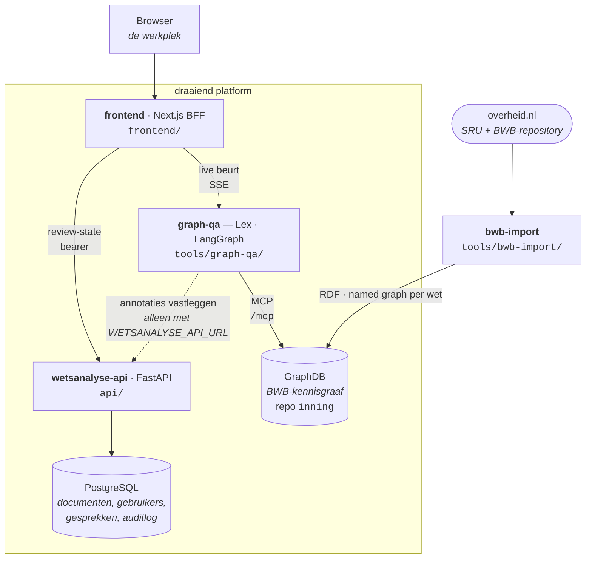
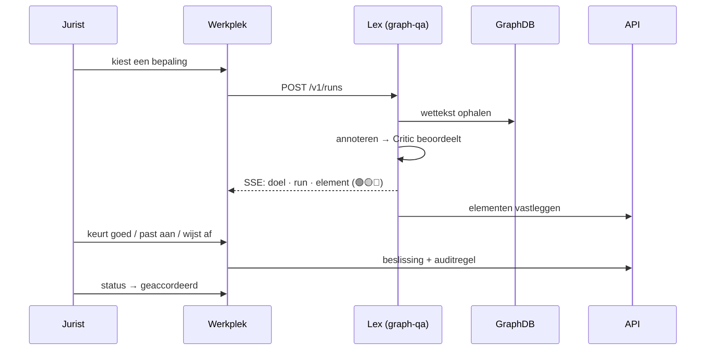

# Wetsanalyse

Een platform dat Nederlandse wet- en regelgeving **gestructureerd, brongetrouw en traceerbaar**
duidt volgens de methode Wetsanalyse (Ausems, Bulles & Lokin) en het Juridisch Analyseschema (JAS).

Een jurist die een wetsartikel klaarmaakt voor uitvoering — een uitkering, een aanslag, een
vergunning — moet expliciet maken wie het rechtssubject is, welke voorwaarden gelden, welke termijn
telt en waar een begrip gedefinieerd staat. Dat gebeurt nu grotendeels in Word en in hoofden: het
kost veel tijd, het resultaat is moeilijk herleidbaar naar de wettekst, en bij een wetswijziging
begint het opnieuw. Wetsanalyse maakt dat werk expliciet en controleerbaar.

Het uitgangspunt is dat **de AI produceert en de mens beoordeelt**. Elk voorstel is herleidbaar naar
artikel, lid en `bronreferentie` (jci-uri); elke beslissing van de jurist landt in een append-only
auditlog. Interpretatiekeuzes — inclusief twijfel en aannames — worden zichtbaar gemaakt in plaats
van weggepoetst tot schijnzekerheid. Het platform is een hulpmiddel voor de jurist, geen vervanger.

> [!IMPORTANT]
> **Scope: activiteit 2** — het markeren van wetsformuleringen en het classificeren daarvan in de
> dertien JAS-klassen. Activiteit 3 (begrippen, afleidingsregels) en de RegelSpraak-formalisering
> zijn *niet* gebouwd. Alle contracten dragen `scope: "act2"`.

## Wat het platform kan

- **Een bepaling laten annoteren.** De agent haalt de wettekst uit de kennisgraaf, stelt markeringen
  met JAS-klasse voor, en een tweede agentrol (de *Critic*) beoordeelt elk voorstel op 🟢/🟡/🔴.
- **Vragen stellen over wetgeving.** Vrije vragen worden beantwoord vanuit de kennisgraaf, met
  bronnen die uit de tool-trace komen — niet uit het proza van het model.
- **Reviewen en vastleggen.** De jurist keurt elk element goed, past het aan of wijst het af; het
  document gaat van `in_review` naar `geaccordeerd` en is te exporteren als PDF, CSV of JSON.
- **De wettekst zelf binnenhalen.** De importer haalt regelingen op bij overheid.nl, valideert ze
  tegen de officiële XSD's en schrijft ze als RDF naar GraphDB — per wet idempotent.

## Architectuur

Vijf diensten. De webapp is de enige die een mens ziet; zij praat met **twee** upstreams — de API
voor alles wat bewaard moet blijven, en de agent rechtstreeks voor de lopende beurt (SSE).



| Onderdeel | Map | Verantwoordelijkheid |
|---|---|---|
| **frontend** | [`frontend/`](frontend/README.md) | Next.js-webapp en BFF. `/workbench` is de werkplek: één gespreksvenster voor vragen én annotatie. Login, rollen, optionele 2FA. Rijkshuisstijl. |
| **wetsanalyse-api** | [`api/`](api/README.md) | Headless FastAPI. Annotatiedomein, gesprekken, gebruikers en login, modelprofielen, berichten, feedback. Identiteitsbron van de webapp. |
| **graph-qa (Lex)** | [`tools/graph-qa/`](tools/graph-qa/README.md) | De agent. Eén LangGraph-graaf met een supervisor die kiest tussen een antwoord-worker en een annotatie-worker. Praat via MCP met GraphDB. |
| **bwb-import** | [`tools/bwb-import/`](tools/bwb-import/README.md) | ETL van overheid.nl naar RDF. Draait op Azure als cron-job, wekelijks. |
| **kennisgraaf** | [`deploy/azure/`](deploy/azure/README.md) | GraphDB 11.4, repository `inning`, met de sinds 11.2 ingebouwde MCP-server op `/mcp`. |
| **de skill** | [`.claude/skills/wetsanalyse/`](.claude/skills/wetsanalyse/SKILL.md) | De JAS-methode als inhoudelijke bron: de dertien klassen en het volg-beleid voor verwijzingen. Documentatie, geen code. |

De naam **Lex** is wat de gebruiker ziet; de code, het image en de env-variabelen heten overal
`graph-qa`.

## Kernbegrippen

| Begrip | Betekenis |
|---|---|
| **JAS** | Juridisch Analyseschema: dertien klassen waarin een wetsformulering wordt ingedeeld. |
| **werkgebied** | De analyse-eenheid. Een kennisdomein met **meerdere** bronnen — niet één artikel. |
| **bron** | Eén `bwbId` + `artikel` + optioneel `lid`. De kleinste citeerbare eenheid. |
| **bronreferentie** | De jci-uri die een markering aan de officiële vindplaats knoopt. Verplicht. |
| **brongetrouw** | Alleen letterlijk opgehaalde wettekst. Een citaat dat niet letterlijk in het corpus staat, wordt geweigerd — mechanisch, niet op goed vertrouwen. |
| **grounding** | Deterministische controle of het antwoord gedekt wordt door de tool-trace. Drie niveaus. |
| **aandachtsniveau** | Het oordeel van de Critic per element: 🟢 groen, 🟡 geel, 🔴 rood. |
| **straat** | Een zelfstandige omgeving op Azure: *acceptatie* of *productie*. |

### De dertien JAS-klassen

Canonieke bron: [`api/app/jas_klassen.py`](api/app/jas_klassen.py) (`JAS_KLASSEN_VOLGORDE`).
Twee andere plekken dragen dezelfde waarden — `frontend/lib/jas.ts`, omdat een browser geen Python
leest, en `tools/graph-qa/agent/jas_klassen.py` — allebei met een drift-test erop. Wijzig je de
lijst, wijzig hem dan overal; de tests wijzen je erop.

`Rechtssubject` · `Rechtsobject` · `Rechtsbetrekking` · `Rechtsfeit` · `Voorwaarde` ·
`Afleidingsregel` · `Variabele en variabelewaarde` · `Parameter en parameterwaarde` · `Operator` ·
`Tijdsaanduiding` · `Plaatsaanduiding` · `Delegatiebevoegdheid en delegatie-invulling` ·
`Brondefinitie`

De volgorde is de weergavevolgorde uit de officiële JAS-tabel; de klassekleuren zijn daaruit
gesampled en worden door een drift-test tussen backend en frontend bewaakt. Uitleg per klasse:
[`jas-klassen-referentie.md`](.claude/skills/wetsanalyse/references/jas-klassen-referentie.md).

### Grounding

Na elk antwoord controleert de agent **zonder extra LLM-call** twee dingen: komt elke genoemde
vindplaats voor in de tool-trace, en staat elk citaat letterlijk in de opgehaalde tekst?

| Niveau | Betekenis |
|---|---|
| `gegrond` | Vindplaatsen en citaten zijn gedekt door de trace. |
| `onbepaald` | Het antwoord noemde geen vindplaats én geen citaat — er valt niets te controleren. |
| `ongegrond` | Er is iets genoemd dat niet in de trace voorkomt. |

`onbepaald` bestaat apart omdat dat als "gegrond" tellen precies de schijnzekerheid zou opleveren
die het platform wil vermijden. Bij `ongegrond` doet de agent hoogstens één corrigerende poging.

## Quick start

> [!NOTE]
> Er is **geen** root-`docker-compose.yml` en **geen** Makefile. Elk onderdeel start apart. Je hebt
> niet alles tegelijk nodig: api + frontend geven je een werkende webapp, de agent vergt daarnaast
> een bereikbare GraphDB.

### Vereisten

| Nodig voor | Vereiste |
|---|---|
| `api/`, `tools/graph-qa/` | [uv](https://docs.astral.sh/uv/) · Python ≥ 3.11 |
| `frontend/` | Node.js (CI draait op 26) · npm |
| `tools/bwb-import/` | Python ≥ 3.13 · pip + venv (dit onderdeel gebruikt **geen** uv) |
| `api/` | PostgreSQL |
| `tools/graph-qa/` | Bereikbare GraphDB ≥ 11.2 **en** een Azure AI Foundry-sleutel |

### 1 · De API

```bash
# PostgreSQL, als je er nog geen hebt
docker run -d -p 5432:5432 \
  -e POSTGRES_USER=wetsanalyse -e POSTGRES_PASSWORD=wetsanalyse -e POSTGRES_DB=wetsanalyse \
  postgres:16

cd api
cp .env.example .env          # vul minimaal WETSANALYSE_API_TOKENS en DATABASE_URL
uv sync --extra llm --extra dev
uv run --env-file .env uvicorn app.main:app --reload --port 3000
```

> [!WARNING]
> `uv run` laadt `.env` **niet** vanzelf. De vlag `--env-file .env` is verplicht — zonder die vlag
> start de API met defaults en verklaart hij zich niet gereed.

Controleer: <http://localhost:3000/health> en de OpenAPI-documentatie op `/docs`.
Tabellen worden bij het starten aangemaakt; er is geen aparte migratiestap.

### 2 · De webapp

```bash
cd frontend
cp .env.example .env.local    # API_TOKEN moet de tokenwaarde ná de ":" zijn
npm install
npm run dev -- -p 3001        # 3000 is bezet door de API
```

De eerste keer maak je via `/setup` eenmalig de eerste beheerder aan. Daarna voegt een beheerder
gebruikers toe; zelfregistratie bestaat niet.

### 3 · De agent (optioneel)

```bash
cd tools/graph-qa
cp .env.example .env          # GRAPHDB_MCP_URL, GRAPHDB_TOKEN, AZURE_FOUNDRY_BASE_URL, _API_KEY
uv run graph-qa               # uvicorn op poort 8080
```

> [!WARNING]
> De dienst **weigert te starten** zonder `GRAPHDB_MCP_URL` en `GRAPHDB_TOKEN` — dat is opzet:
> een agent zonder graaf zou vragen gaan beantwoorden zonder bron. `AZURE_FOUNDRY_BASE_URL` moet
> op `/anthropic` eindigen.

Laat de webapp hem vinden met `GRAPH_QA_URL` en `GRAPH_QA_TOKEN` in `frontend/.env.local`.

### 4 · De graaf vullen (optioneel)

```bash
cd tools/bwb-import
python3 -m venv .venv
.venv/bin/python -m pip install -r requirements.txt
cp .env.example .env                                  # GRAPHDB_URL wijst naar jouw GraphDB
.venv/bin/python main.py BWBR0004770                  # Invorderingswet 1990
```

Meerdere regelingen: geef ze als losse argumenten. Er zijn geen vlaggen — alle instellingen zijn
env-variabelen. Herimporteren is veilig: elke wet krijgt een eigen named graph die integraal wordt
vervangen.

## Werkstromen

### Een bepaling annoteren



De agent draait de beurt; de browser kijkt mee. Verbreekt de verbinding, dan loopt de run door — de
werkplek haalt de gemiste events op met `?vanaf=<seq>`. Dat is waarom `/v1/runs` bestaat naast
`/v1/chat`.

**De Critic corrigeert niet zelf.** Code voert de correcties uit, niet een tweede taalmodel: alleen
🔴 met een concreet vervangingsvoorstel wordt doorgevoerd, en alleen als het vervangende fragment
letterlijk in de wettekst staat. 🟡 verandert nooit iets — dat wordt een alternatief dat de jurist
naast het voorstel ziet. Zo kan een tweede modelronde geen tekst introduceren die er niet stond.

### Een vraag stellen

Een supervisor kiest per vraag één specialist: `definitie` (begrippen opzoeken), `duiding` (context
en samenhang) of `algemeen` (alle tools). De specialist bevraagt de graaf, waarna grounding het
antwoord toetst en de bronnen uit de tool-trace worden verzameld.

## Projectstructuur

```
api/                  FastAPI-backend
  app/routers/          annotatie · admin · auth · gesprekken · berichten · feedback · catalog
  app/db.py             SQLAlchemy Core-tabellen (geen ORM-klassen, geen Alembic)
  app/jas_klassen.py    de dertien JAS-klassen (canonieke bron)
  app/validation.py     klassevalidatie voor het annotatiedomein
frontend/             Next.js-webapp
  app/workbench/        de werkplek
  app/api/              de BFF; _lib/proxy.ts en _lib/trace.ts zijn gedeeld
  lib/                  de rekenkern — hier staat de testbare logica
tools/graph-qa/       de agent (Lex)
  agent/orchestrator.py de LangGraph-graaf: alle nodes en routers
  agent/supervisor.py   workerkeuze + specialistkeuze, met harde allowlist
  agent/annotatie.py    annotatiedomein; pas_critic_toe voert correcties uit
  agent/grounding.py    de brongetrouwheidscontrole
  agent/tools/          de getypeerde toollaag boven MCP
tools/bwb-import/     ETL overheid.nl → RDF
  app/parser.py         XML → dataclasses
  app/rdf_vocab.py      IRI-schema en namespaces
  app/graphdb_writer.py named graphs, FTS-connector, WTI-verrijking
  schemas/              de officiële XSD's (gecommit, gaan mee in de image)
.claude/skills/wetsanalyse/   de JAS-methode als documentatie
deploy/azure/         main.bicep — de volledige stack
docs/                 methodische onderbouwing en plannen
```

Toolinstellingen per onderdeel staan in de eigen `CLAUDE.md`
([api](api/CLAUDE.md) · [frontend](frontend/CLAUDE.md) · [graph-qa](tools/graph-qa/CLAUDE.md)).

## Configuratie

Elk onderdeel heeft een `.env.example` met uitleg per variabele — dat bestand is de gezaghebbende
lijst. Hieronder alleen wat je bij het opstarten echt moet weten.

**Overal geldt het `*_FILE`-patroon**: `LLM_API_KEY_FILE` heeft voorrang op `LLM_API_KEY`. Zo
komen secrets als bestand binnen in plaats van als omgevingsvariabele.

| Variabele | Onderdeel | Default | Waarom het ertoe doet |
|---|---|---|---|
| `WETSANALYSE_API_TOKENS` | api | leeg | Per-client bearer-tokens, vorm `id:token,id2:token2`. Leeg met auth aan ⇒ **alles 401**. |
| `WETSANALYSE_ADMIN_TOKENS` | api | leeg | Aparte tokens voor `/v1/admin/*`. Kent géén auth-bypass. |
| `DATABASE_URL` | api | `postgresql+asyncpg://localhost:5432/wetsanalyse` | Async driver (`asyncpg`) is verplicht. |
| `LLM_CONFIG_SECRET` | api | — | Fernet-sleutel voor API-keys **en** 2FA-secrets. Raak je hem kwijt, dan zijn beide onleesbaar. |
| `API_BASE_URL` / `API_TOKEN` | frontend | `http://wetsanalyse-api:3000` | `API_TOKEN` is alleen de waarde ná de `:`. |
| `GRAPH_QA_URL` / `GRAPH_QA_TOKEN` | frontend | `http://graph-qa:8080` | Zonder deze bereikt de werkplek de agent niet. |
| `AUTH_SECRET` | frontend | — | Verplicht voor de login. |
| `AUTH_URL` | frontend | — | **Verplicht achter een reverse proxy**, anders springt in-/uitloggen naar het interne adres. |
| `GRAPHDB_MCP_URL` / `GRAPHDB_TOKEN` | graph-qa | leeg | Verplicht; de dienst start er niet zonder. |
| `AZURE_FOUNDRY_BASE_URL` / `_API_KEY` | graph-qa | — | Moet op `/anthropic` eindigen. |
| `SIMILARITY_INDEX` | graph-qa | leeg | Leeg ⇒ `semantic_search` degradeert naar tekstzoeken. |
| `QA_API_TOKEN` | graph-qa | leeg | **Leeg = open**. Verplicht zodra de agent naar de API schrijft. |
| `GRAPHDB_URL` | bwb-import | `http://graphdb:7200` | Waar de importer naartoe schrijft. |
| `BWB_IMPORT_WTI` | bwb-import | `false` | Zet de WTI-verrijking aan (organisatie, wetsfamilie, grondslagen, rechtsgebieden). |
| `OTEL_EXPORTER_OTLP_ENDPOINT` | alle | leeg | Leeg = alleen JSON-logs, nul overhead. |

**Taalmodellen worden niet via env beheerd.** Ze leven als benoemde *modelprofielen* in PostgreSQL en
zijn tijdens runtime te beheren via de beheertab of `/v1/admin/profiles` — zonder redeploy. De
`LLM_*`-waarden seeden alleen het eerste profiel bij de allereerste start. De agent staat hier los
van: die heeft een eigen LLM-configuratie.

## De kennisgraaf

De importer schrijft RDF met **twee bewust gescheiden namespaces**:

| Namespace | Rol |
|---|---|
| `urn:bwb:` | resources — `urn:bwb:BWBR0004770:artikel:9:lid:1` |
| `urn:bwb-ns:` | de ontologie (prefix `bwb:`) |

Twee ontwerpkeuzes die het uitleggen waard zijn. **URN's en geen http-IRI's**, omdat een domeinnaam
in het datamodel de data bindt aan wie dat domein toevallig bezit; verhuizen zou een volledige
herimport kosten. Dat een URN niet dereferenceerbaar is kost niets, want elke citeerbare node krijgt
een `owl:sameAs` naar `wetten.overheid.nl`. En **`urn:bwb-ns:` en niet `urn:bwb:ns:`**, omdat de
provenance-controle in de agent op de documentbasis prefixt — met de tweede vorm zou elk predicaat
als vindplaats worden herkend en zouden predicaten als "bron" onder een antwoord verschijnen.

Structuur (`bwb:Regeling` → hoofdstuk/afdeling → artikel → lid → onderdeel) sluit aan op ELI
(`eli:LegalResource`, `eli:has_part`, `eli:cites`); rechtsgebieden worden SKOS-concepten. Verwijzingen
krijgen een eigen `bwb:Verwijzing`-resource, zodat soort en betrouwbaarheid vastgelegd kunnen worden
— een uit tekst afgeleide verwijzing draagt `bwb:betrouwbaarheid "laag"`.

De agent krijgt **geen vrije SPARQL**, maar een getypeerde toollaag: tekst zoeken, een artikel of lid
ophalen, verwijzingen volgen in beide richtingen, context opvragen, een begrip resolven. Alleen
`raw_sparql` is een uitweg, en een allowlist laat daar uitsluitend lezende queries door.

## De agent (Lex)

Eén LangGraph-graaf, twee routes. De supervisor kiest per vraag; zijn antwoord wordt hard gesaneerd
tegen een allowlist, zodat een verzonnen workernaam nergens toe leidt.

```
supervisor ─┬→ agent ⇄ tools → verify ─┬→ correct → agent
            │                          └→ finalize
            └→ annoteer → critic → patch → [herzie → critic] → emit
```

De annotatieketen is **lineair, geen lus**: hooguit vier modelaanroepen, en een schone annotatie
kost er twee. Details in [`tools/graph-qa/README.md`](tools/graph-qa/README.md); de toon van Lex
staat in [`docs/schrijfrichtlijn-lex.md`](docs/schrijfrichtlijn-lex.md), zijn identiteit in
`agent/prompts.py`.

**Provider.** Er is één LLM-pad: Anthropic via Azure AI Foundry. Dat zit achter een `LLMPort`-
protocol, dus een tweede provider is een extra adapter — maar die bestaat vandaag niet. Modellen
zijn per rol instelbaar (`LLM_MODEL`, `LLM_MODEL_ROUTER`, `LLM_MODEL_OPHAAL`).

**Wat deterministisch is en wat niet.** Het markeren en classificeren is probabilistisch; de
controles eromheen zijn dat niet. Grounding, de letterlijke-citaattoets, de klassevalidatie en het
uitvoeren van Critic-correcties zijn gewone code. Twee runs over dezelfde bepaling leveren
verschillende markeringen op — meet daarom nooit een trend op één run.

## Testing

Eén poort, twee plekken. Lokaal via een git-hook, hard via de PR-check `poort`. Beide draaien alleen
de suites van de onderdelen die je raakt.

```bash
git config core.hooksPath .githooks     # eenmalig per kloon; SKIP_HOOK=1 omzeilt
```

| Onderdeel | Commando | Omvang |
|---|---|---|
| `api/` | `uv run pytest -q` | 172 tests; SQLite in-memory, geen netwerk |
| `tools/graph-qa/` | `uv run --extra dev pytest -q` | 443 tests |
| `tools/bwb-import/` | `.venv/bin/python -m pytest` | 80 tests |
| `frontend/` | `npm test && npm run lint && npm run typecheck` | 275 tests in 20 bestanden (vitest) |

Samen 970 tests; alle vier de suites draaien zonder netwerk of draaiende diensten.

**Wat er níét getest wordt.** De frontend draait vitest in een node-omgeving zonder DOM: er zijn geen
componenttests en geen Playwright. Daarom staat de rekenkern in `frontend/lib/` — wat daar niet
staat, is niet getest. GraphDB-integratietests staan achter de marker `integration` en worden
standaard overgeslagen.

**Driftbewaking** is een eigen testcategorie: klassekleuren tussen API en frontend, het
ontdubbelingsalgoritme dat op drie plekken bestaat, de veld-voor-veld-vergelijking van agent- en
API-modellen, en de RDF-termen die de writer gebruikt tegen de gedeclareerde ontologie.

**Kwaliteitsmeting van de agent** gaat via een eval-harnas met twee gouden sets:

```bash
cd tools/graph-qa
.venv/bin/python eval/run_eval.py --offline               # antwoorden
.venv/bin/python eval/run_eval.py --annotatie --offline   # annotaties
```

De annotatieset scheidt **garanties** (letterlijke fragmenten, bestaande klassen, prompt-injectie-
kanaries — slagen of zakken) van **trendmeting** (precisie/recall, géén slaagcriterium, omdat JAS
interpretatieruimte kent).

## Development

| Ik wil… | Kijk in |
|---|---|
| een JAS-klasse wijzigen | `api/app/jas_klassen.py`, plus `frontend/lib/jas.ts` en `tools/graph-qa/agent/jas_klassen.py` (drift-tests bewaken het) |
| een endpoint toevoegen | `api/app/routers/` **en** de bijbehorende BFF-route in `frontend/app/api/` |
| iets aan het agentgedrag veranderen | `tools/graph-qa/agent/orchestrator.py` + de prompts ernaast |
| de RDF-modellering uitbreiden | `tools/bwb-import/app/rdf_vocab.py` + `app/ontology.py` (drift-test bewaakt beide) |
| infra aanpassen | `deploy/azure/main.bicep` |

> [!WARNING]
> Voeg je een BFF-route toe die zelf fetcht, gebruik dan `metTrace()` uit
> `frontend/app/api/_lib/trace.ts`. Laat je het weg, dan faalt het **stil**: de telemetrie komt
> gewoon binnen, alleen het verband tussen de diensten ontbreekt. Hetzelfde geldt voor
> query-parameters — een proxyroute die een parameter laat vallen, laat een filter stil mislukken.

**Uitrollen.** Azure is het enige uitrolpad, in twee straten. Een merge naar `master` rolt uit naar
**acceptatie** — dat is tevens de proeftuin, want een dev-omgeving bestaat niet. Productie gaat via
een tag `v*`: `promote.yml` bouwt niets, maar neemt de digests over die op acceptatie draaien, en
toetst of die bij de getagde commit horen. Infra blijft handmatig via `azure-infra.yml`. Zie
[`deploy/azure/README.md`](deploy/azure/README.md).

## Troubleshooting

| Symptoom | Oorzaak en oplossing |
|---|---|
| API start, maar alles geeft `401` | `WETSANALYSE_API_TOKENS` is leeg terwijl auth aanstaat. Fail-closed. Vul tokens, of zet `WETSANALYSE_AUTH_REQUIRED=0` (alleen lokaal). |
| API start met lege configuratie | Je vergat `--env-file .env` bij `uv run`. |
| `/beheer` geeft `403` | Je gebruiker heeft rol `analist`, of `ADMIN_API_TOKEN` ontbreekt in de frontend. |
| graph-qa weigert te starten | `GRAPHDB_MCP_URL` of `GRAPHDB_TOKEN` ontbreekt — bewuste fail-fast. |
| Inloggen springt naar een intern adres | `AUTH_URL` staat niet op de publieke origin. Verplicht achter een proxy. |
| `semantic_search` gedraagt zich als tekstzoeken | De similarity-index is leeg of `SIMILARITY_INDEX` is niet gezet. Na een herstart van de graaf moet die index eerst herbouwd worden. |
| Alle graafvragen leveren niets op | De graaf is leeg. Draai de importer; de opslag op Azure is niet-persistent. |
| De werkplek toont 0 elementen | SSE-frames worden met `\r\n` gescheiden; een handgeschreven parser die de CR niet strookt, levert stil niets op. |
| Een filter werkt niet, zonder foutmelding | Een BFF-proxyroute stuurt de query-parameter niet door. |
| Port 3000 al in gebruik | API en frontend willen allebei 3000. Draai de webapp met `-p 3001`. |
| Trage of afgebroken LLM-calls | `WETSANALYSE_LLM_TIMEOUT_S` staat standaard op 300 seconden. |

## Security & privacy

- **Drie auth-lagen.** Gebruikers loggen in op de webapp (Auth.js, bcrypt, optionele TOTP). De BFF
  praat server-naar-server met een bearer-token dat de browser nooit ziet. Beheer zit achter een
  apart admin-token dat geen bypass kent. Tokenvergelijking is constant-tijd.
- **Per gebruiker gescopet.** Annotatiedocumenten en gesprekken van een ander leveren een 404, niet
  een 403 — dat lekt niet eens het bestaan.
- **Versleuteld at rest.** API-keys van modelprofielen en 2FA-secrets gaan met dezelfde
  Fernet-sleutel de database in. API-keys worden nooit teruggegeven, alleen `api_key_set`.
- **Auditlog.** Elke beslissing over een element is append-only vastgelegd.
- **De repo is publiek.** Een CI-guard (`geen-omgevingsgegevens`) blokkeert hostnamen, interne IP's
  en machinenamen. Neem die dus niet op in code of documentatie.
- **Kwetsbaarhedenbeheer.** `pip-audit` en `npm audit` draaien vóór elke image-build, Trivy erna met
  een gate op CRITICAL. Dependabot draait wekelijks.
- `POST /v1/chat` op de agent kent **geen eigenaarscontrole** en is niet bedoeld voor de webapp;
  daarvoor bestaat `/v1/runs`.

## Beperkingen

Eerlijk over wat er nog niet is:

- **Alleen activiteit 2.** Begrippen, afleidingsregels en RegelSpraak zijn niet gebouwd.
- **De graaf op Azure is niet-persistent.** GraphDB gebruikt memory-mapped files en kan geen
  netwerkschijf gebruiken. Hij is volledig reproduceerbaar uit overheid.nl en vult zichzelf na een
  deploy, maar de similarity-index overleeft een herstart evenmin.
- **Geen migratietool.** Bij het starten worden ontbrekende tabellen en kolommen additief
  bijgewerkt; kolommen hernoemen of typen wijzigen gaat zo niet.
- **De agent draait in één proces.** Het run-register zit in het geheugen — geen `--workers`. Meer
  dan één replica vereist een gedeelde checkpointer (`CHECKPOINT_DB_URL`).
- **Annotatieruns variëren sterk** tussen draaibeurten over dezelfde bepaling. Trek geen conclusie
  uit één run.
- **De JAS-kennistools** bestaan in de code maar worden in de draaiende keten niet aangeroepen.
- **Eén LLM-provider.** Anthropic via Azure AI Foundry; alternatieven vergen een nieuwe adapter.
- `docs/regelspraak/` is lokaal werkmateriaal en zit **niet** in de repository.

## Licentie & herkomst

Copyright © 2026 Willard Palm

*Licensed under the EUPL* — de broncode staat onder de **European Union Public Licence v1.2**, de
licentie die de EU en de Rijksoverheid voor overheidssoftware aanhouden. De volledige tekst staat in
[`LICENSE`](LICENSE); de officiële Nederlandse versie, juridisch gelijkwaardig, in
[`LICENSE.nl`](LICENSE.nl).

Niet alles in deze repository is van ons, en die delen vallen buiten de EUPL:

| Onderdeel | Voorwaarden |
|---|---|
| [`docs/wetsanalyse/wetsanalyse-rijk/`](docs/wetsanalyse/wetsanalyse-rijk/BRON.md) | De methode en het JAS, van het ministerie van BZK, onder de **W3C Software and Document License** — zie de [`LICENSE`](docs/wetsanalyse/wetsanalyse-rijk/LICENSE) in die map. |
| `docs/wetsanalyse/WetsTaal.md` | De WetsTaal-handreiking (Belastingdienst / PNA Group), publiek gepubliceerd. |
| `frontend/public/belastingdienst-logo.svg` | Beeldmerk van de Belastingdienst. Merkrecht; geen onderdeel van de licentie en niet vrij herbruikbaar. |
| De wettekst in de graaf | Van overheid.nl (SRU + BWB-repository), **CC-0**. Geen API-sleutel nodig. |
| GraphDB | Vereist een eigen licentie van Ontotext; zonder licentiebestand komt de database read-only op. |

Het boek *Wetsanalyse* (Boom uitgevers) en de readers van het Expertisecentrum BRM zijn **geen
onderdeel van deze repository** — dat is materiaal van derden dat niet publiek verspreid hoort te
worden. Wie ze rechtmatig heeft, kan ze lokaal in `docs/wetsanalyse/` plaatsen; `.gitignore` houdt
ze buiten git.

## Verder lezen

| Document | Onderwerp |
|---|---|
| [`docs/observability.md`](docs/observability.md) | Logschema, tracing door de keten, AVG-redactie |
| [`docs/wetsanalyse-workbench/PLAN.md`](docs/wetsanalyse-workbench/PLAN.md) | Het plan achter de werkplek |
| [`docs/wetsanalyse-workbench/jas-annotatie-ontologie.md`](docs/wetsanalyse-workbench/jas-annotatie-ontologie.md) | De annotatielaag in RDF (nog niet gebouwd) |
| [`docs/kennisbank/PLAN.md`](docs/kennisbank/PLAN.md) | Een tweede corpus naast de wetsgraaf — lees dit vóór je aan retrieval werkt |
| [`verwijzingen-volgen.md`](.claude/skills/wetsanalyse/references/verwijzingen-volgen.md) | Wanneer een verwijzing wel of niet gevolgd wordt |
| [`tools/wetsanalyse-admin-mcp/`](tools/wetsanalyse-admin-mcp/README.md) | De admin-API als MCP-tools |
