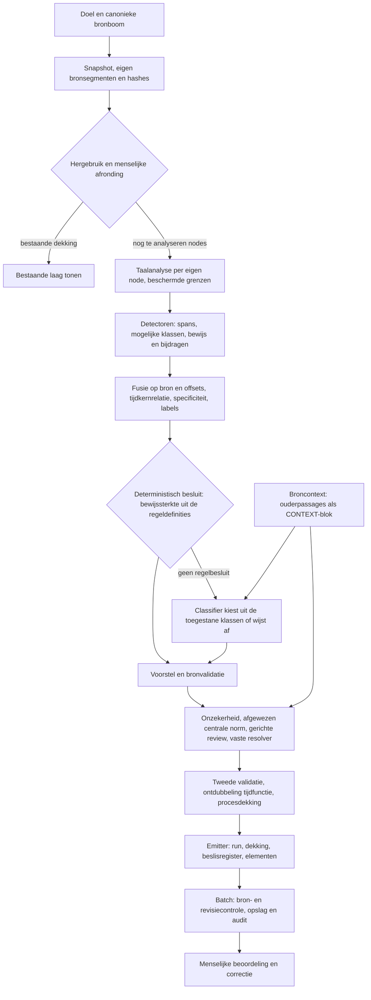

# Annotatieketen `hybrid_v1`

Soort: *specificatie* (zie [`../README.md`](../README.md)) · Stand: baseline 29 september 2026 ·
JAS 1.0.10

Dit document beschrijft hoe de annotatieketen **nu** werkt: welke stap wat ontvangt, wat hij mag
beslissen, hoe je hem instelt en waar zijn grenzen liggen. Het moet met de code meebewegen. Het
**waarom** van de opzet staat in [ADR-001](adr-001-hybride-jas-pijplijn.md), de taalprovider in
[ADR-002](adr-002-taalprovider.md), het contract voor opslag en ankers in
[`annotatie-bronnodes.md`](annotatie-bronnodes.md) en de metingen in het
[meetlogboek](metingen/README.md). Het open werk staat in [`../PLAN.md`](../PLAN.md), spoor A.

Codepaden zijn relatief aan `tools/graph-qa/agent/`, tenzij anders vermeld.

**Grondregel.** Detectoren bepalen fragmentgrenzen en de ruimte van mogelijke klassen. Het model
kiest daarbinnen, of wijst af. Het model voegt nooit een span, klasse, partij of anker toe. Procesdekking,
stabiliteit en technische validiteit zeggen niets over juridische juistheid.

## Ketenkaart



## Stappen

| Stap en code | Ontvangt en voegt toe | Mag beslissen | Grens en zichtbaarheid |
|---|---|---|---|
| **Afbakening**: `aanwijzing.py`, `nodes/supervisie.py`, `doel._meerdere_artikelen` | Vraag → genoemde artikelen en leden | Eén artikel per vraag. Meer artikelen wordt afgewezen met het verzoek de vraag per artikel te stellen: deterministisch op de vraag, via de ophaal-JSON `meerdere` en als vangnet op de fetch-calls | Geen modelcall bij een afwijzing op de vraag. Meerdere artikelen samen is een werkgebied (PLAN spoor D) |
| **Keuze van de bronnode**: `bronmodel.onderdelen_om_te_kiezen`, `BronKeuze`, `nodes/annotatie._keuzekaart`, `bron_annotatie.stand_per_optie` | Snapshot → leden (bij een artikel) of subbepalingen (bij een divisie) met hun stand uit één `weergave` | Bij twee of meer: geen analyse, maar een `kandidaten`-event met `keuze`; genoemde leden staan vooraf aangevinkt. Een onbekend lid of een dubbelzinnig nummer geeft ook een keuze. Beleidsregel "9 lid 1" wordt 9.1 als die bestaat. `doel.geheel` slaat de keuze over (eval) | Alle opties en fragmenten komen letterlijk uit de brongraaf. Vóór hergebruik en vóór elke modelcall |
| **Reeks**: `reeks.py`, `bronmodel.gedeelde_bepaling` | `doelen` (onderdelen van één bepaling) → per onderdeel een gewone beurt | Stoppen en budget tussen onderdelen; een fout in één onderdeel stopt de rest niet | Elk onderdeel een eigen laag, batch, bericht en `run_id` `<run>.<n>`; events dragen `onderdeel` |
| **Bronophaling**: `nodes/annotatie.py`, `bron_annotatie.lees_bron`, `bronmodel.resolve` | Doel → canonieke boom, snapshot-ID, node-IRI, eigen tekst, SHA-256, corpusmapping | Welke node of subboom wordt geanalyseerd; opmaak bepaalt geen offsets | Een bronfout stopt de beurt. Er is geen webterugval |
| **Hergebruik**: `bron_annotatie.controleer_hergebruik` | Snapshot + bestaande lagen → hergebruikte nodes | Volledig hergebruik slaat detectie over. Door een mens afgeronde nodes worden niet overschreven | Hergebruik heeft eigen events en een eigen runmodus. Bronversies worden niet stil gemengd |
| **Taalanalyse**: `jas_pipeline/keten._bronteksten`, `taal/provider.py` | Eigen tekst per node, oudertekst als apart veld; tokens, zinnen, lemma's, POS, dependencies, providerversie | Een volledige parser bepaalt zijn eigen zinnen en dependencies | Als de parse ontbreekt of faalt: `niveau=TOKENS`, `meting.gedegradeerd` en een waarschuwing voor de gebruiker. Parse-detectoren slaan zichtbaar over |
| **Detectie**: `jas_pipeline/detectoren/*` | Exacte spans, alternatieve spans (opties), mogelijke klassen, bewijs, oorspronkelijke bijdragen | Fragmentgrenzen en hypotheseruimte. Verwijzingsmaskers onderdrukken interne treffers | Geen juridische acceptatie. Nul treffers betekent niet dat er niets is. De identiteit van het resultaat wordt gecontroleerd (`detecteer_alles`) |
| **Fusie**: `fusie.py`, `specificiteit.py` | Eén kandidaat per bron/offsetpaar met de unie van bewijs en klassen, opties, overlaprelaties, labels. Een exacte tijdkern krijgt T als extra hypothese en verwijst naar de langere kandidaat (`TEMPORAL_KERNEL`, fusie v3) | Specificiteit (JAS-voorrang) beperkt klassen of wijst af | Overlap en nesting blijven aparte kandidaten. Fusie verlengt geen spans en vindt geen gemiste kandidaten. Oorspronkelijke bijdragen blijven intact |
| **Besluit**: `besluit.py`, `bewijssterkte.py` | Kandidaat → vast regelbesluit of doorgeven aan het model | Zie *Beslisbeleid* | — |
| **Classificatie**: `classificatie.py` | Batches met labels en de toegestane klassen; broncontext als apart blok | Een aangeboden klasse of `Geen annotatie`. Spankeuze staat uit, en ingeschakeld mag hij alleen uit bestaande opties kiezen | Een ongeldige keuze wordt `UNCERTAIN` met een code. Er wordt nooit een fragment verzonnen |
| **Eerste validatie**: `validatie.py`, `keten._voorstel` | Voorstellen + corpusmapping + snapshot | Ankers, klasse, provenance en dubbele functies controleren; bij een fout `REJECTED` | De foutcode blijft bewaard. Offsets of tekst worden niet gegokt |
| **Review**: `onzekerheid.py`, `review.py`, `resolver.py`, `reviewload.py` | Concrete conflicten, abstain en een afgewezen enige centrale norm | Reviewer: KEEP / CHANGE / HUMAN_REVIEW. De resolver voert een vaste tabel uit | Alleen binnen bestaande alternatieven. Een ongeldige reviewreactie gaat naar de mens. Bij een gedegradeerde parse gaat het direct naar de jurist |
| **Tweede validatie en dekking**: `keten.py`, `dekking.py`, `besluit.ontdubbel_tijd` | Gewijzigde voorstellen gaan opnieuw door de controles; één eindbesluit per kandidaat | Geen kandidaat blijft `UNHANDLED`. Van korte en lange T voor dezelfde functie blijft de lange | Structurele dekking noemt de dimensies die zijn uitgevoerd of overgeslagen en de ongedekte zinsdelen. Dat is geen recall |
| **Registratie**: `beslisregister.py`, `nodes/annotatie.py` | Runmeting, voorstellen, besluiten, ruwe bijdragen → events `run`, `dekking`, `element` | Alleen voorstellen worden elementen | Afgewezen kandidaten blijven in het beslisregister met bewijs, klassen en bijdragen. De oorspronkelijke modelreden overleeft de resolver |
| **Opslag**: `beurt.py`, api `annotatie_v2_store.batch` | Batch met snapshot, revisies, elementen, run, dekking, beslisregister | Scope en ankers opnieuw valideren; idempotente transactie | Een conflict in snapshot of revisie geeft een fout. De menselijke historie wordt nooit overschreven |
| **Mens**: api `annotatie_v2_store.beslis`, frontend `NodeAnnotatiePaneel.tsx` | Voorstellen, alternatieven, bron, historie | Goedkeuren, afwijzen, corrigeren, heropenen | Een gemiste detectie is een beoordelingsvraag. Die recall wordt niet automatisch hersteld |

Een onverwachte exception, zoals een geschonden detectorcontract, komt als gesaniteerd
`error`-event bij de gebruiker; de volledige fout staat in het log. Er wordt dan geen meting en geen
set annotaties gefingeerd.

## Configuratie

`config.py`, te zetten via de omgeving:

| Instelling | Env | Standaard | Betekenis |
|---|---|---|---|
| `classifier_granulariteit` | `CLASSIFIER_GRANULARITEIT` | `klasseverzameling` | De tool-enum per batch is precies de toegestane klasseverzameling. Alternatieven: `universeel` (de oude freeze-default) en `familie`. De keuze is gemaakt met een vooraf vastgelegd criterium in de baselineproef |
| `classifier_parallel` | `CLASSIFIER_PARALLEL` | `4` | Hoeveel classificatiebatches tegelijk naar het model gaan. De batches zijn onafhankelijk; de beslissingen komen in batchvolgorde terug, dus de uitkomst is gelijk aan `1` (na elkaar). Vier batches van ~15 s duurden na elkaar een minuut. Staat als `classifier_parallel` in de meting en de run-instellingen |
| `deterministisch_accepteren` | `DETERMINISTISCH_ACCEPTEREN` | `true` | Regelbesluiten zonder model (zie hieronder) |
| `gerichte_review` | `GERICHTE_REVIEW` | `true` | Tweede modeloordeel op twijfelgevallen en centrale afwijzing |
| `classifier_spankeuze` | `CLASSIFIER_SPANKEUZE` | `false` | Het model mag uit de bestaande spanopties kiezen |
| `broncontext` | `BRONCONTEXT` | `true` | `BronContext.ouders` meegeven als `CONTEXT`-blok |

De taalprovider is `spacy:nl_core_news_md` ([ADR-002](adr-002-taalprovider.md)). Het model laadt
bij het opstarten van de dienst op een achtergrondthread (`keten.warm_taalmodel_op`); daarvóór
betaalde de eerste beurt na een koude start het laden (~5 s) in de fase *Taalanalyse*. Een vergelijkbare
meting vereist een echte parse. Elke run legt de versies van model, prompt, schema, detectoren,
tekstgrenzen, structuur en verwijzingen vast, plus `methode_versie` en de prompt-hash. Zet voor
metingen `AGENT_VERSION` op de commit.

## Beslisbeleid

- **Deterministisch accepteren** vereist precies één mogelijke klasse en uitsluitend sterk bewijs.
  `PRIORITY_APPLIED` is administratief. De sterkte wordt **afgeleid uit de regeldefinities**
  (`bewijssterkte.py`): elke regel verklaart haar sterkte in de YAML (`bewijs:`) of als `BEWIJS` op
  een codedetector. Een code is alleen sterk als al haar regels sterk zijn en dezelfde klasse
  aanwijzen. Een klasse met determinisme `laag` in het profiel heeft geen sterke code.
- **Sterk boven generiek**: generiek NP-bewijs (`SUBJECT_NP`, `OBJECT_NP`, `ENUMERATED_NP`)
  blokkeert sterk patroonbewijs niet. Ander zwak bewijs doet dat wel.
- **Afwijzing door specificiteit** is een aparte deterministische route.
- **Afgewezen centrale norm**: blijft de enige normkandidaat afgewezen terwijl er nog
  Rechtsobject- of Tijdsaanduiding-voorstellen staan, dan volgt één gerichte herbeoordeling per
  normeenheid. De oorspronkelijke afwijzing blijft bewaard. Ontbreekt de gevraagde context, dan gaat
  het naar de mens.
- **Onzekerheid** wordt uitgedrukt in codes en aandacht-niveau, nooit in een confidence-getal.
- **Geen klasse gekozen** (abstain zonder bruikbaar reviewoordeel, `R-ABSTAIN-HUMAN`/`R-ONGELDIG`):
  de resolver zet de eerste mogelijke klasse **voorlopig** neer, zodat de jurist een kaart heeft om
  te kiezen. De beslisser is dan `terugval`, niet `model` – in het spoor, de graaf
  (`besluit:terugval`), de export en het zoekfilter. Aanleiding: art. 9 lid 5 IW 1990, waar "één
  maand" als Rechtsobject in de laag stond terwijl het model niets had gekozen.

## Broncontext

`broncontext.py` levert alleen passages van ouders die de keten al heeft (`BronContext.ouders`). De
runtime haalt zelf geen andere artikelen op. Het maximum is twintig unieke passages, met controle
op de teksthash. Een passage met een afwijkende hash wordt als ontbrekend gemeld en stopt de
annotatie niet. De context staat als eigen blok **ná** de afgesloten bepaling. Hij is nooit een
annotatiedoel of offsetruimte.

Let op: bij wetsartikelen zonder eigen artikeltekst levert dit in de praktijk niets op. Bij de
Leidraad wel. `herkomst=graaf` is een intern contract, geen cryptografisch bewijs.

## Gedeelde taalvoorzieningen

- **`taal/grenzen.py`**: beschermde bereiken (verwijzingen, numerieke notaties, afkortingen,
  onderdeelnummering) worden vóór de grenzen herkend. `. ! ?` sluiten een zin en segment, `; :`
  alleen een segment. Een regelovergang is tekstomloop, een lege regel is een alineagrens. De duizendpunt
  in `€ 1.000` is beschermd, maar het bedrag blijft kandidaat. Volledige parses worden niet
  aangepast.
- **`taal/verwijzingen.py`**: de gedeelde verwijzingspatronen. Ook `artikel 9.1` en `artikel 3:4`
  vallen volledig binnen het masker. De masker-YAML verwijst ernaar via `herkenner`.
- **`taal/structuur.py`**: een venster vanaf de eigen aanhef (of de bronstart als de aanhef in de
  ouder staat) tot de volgende aanhef of het einde van de node. Nummering begrenst onderdelen, ook
  op één regel. `_Venster.bereik` vertaalt terug naar eigen bronoffsets. Declaratieve regels met
  `bereik=segment` gebruiken dezelfde terugvertaling.
- **Detectorresultaatcontract** (`detectoren/__init__.py`): naam en versie komen alleen van het
  detectorobject, ook bij nul treffers en overslag. `detecteer_alles` controleert naam, versie,
  bron, bewijs- en bijdrage-identiteit en geldige overslag.

## Detectoren

Zeventien actieve generators (`standaard_detectoren()`). Klassen: RS Rechtssubject, RO Rechtsobject,
RB Rechtsbetrekking, RF Rechtsfeit, VW Voorwaarde, AR Afleidingsregel, V Variabele(waarde), P
Parameter(waarde), O Operator, T Tijdsaanduiding, L Plaatsaanduiding, D Delegatie, B
Brondefinitie. Actuele versies staan in de runmeting. De regels en hun vier testsoorten staan in
`jas_pipeline/detectoren/regels/*.yaml`.

| Detector | Signaal | Mogelijke klassen | Parse | Bekend risico |
|---|---|---|---|---|
| tijd | datum (ook zonder jaartal), duur, periode, moment, bijwoord | T | nee | contextloze tijdswoorden; `binnen een redelijke termijn` gemist |
| voorwaarde | conditioneel of causaal voegwoord, vaste formule | VW (bij *wegens* ook RF) | nee | `zodra`, samengestelde eisen; een komma kapt een bijzin af |
| operator | vergelijkings-, reken- en logische lexemen | O | nee | operanden ontbreken |
| afleiding | *bedraagt*, passieve berekening, fictie of vermoeden | AR (bij *bedraagt* ook P) | nee | invoer en uitvoer niet gemodelleerd |
| numeriek | eurobedrag, percentage, veelvoud | P/V, veelvoud O/P | nee | kaal getal niet gedekt |
| delegatie | *bij/krachtens … regels gesteld* | D | nee | delegatie-invulling heeft geen eigen route |
| plaats | gazetteer, lidstaatomschrijving | L | nee | gebied in een eigennaam niet gemaskeerd |
| subject | rolwoord of voornaamwoord | RS/RO | nee | een rolvermelding bewijst geen drager |
| definitie | *verstaan onder* + term:omschrijving | B | nee | varianten buiten het patroon |
| betekenis | *betekent:* + term | VW/RO | nee | niet elke betekent-formule is een VW |
| norm | modaal of normatief lexeme per segment | RB; RF alleen met rechtsgevolg (`LEGAL_EFFECT_PREDICATE`) | nee | impliciete normen |
| gevolg | rechtsgevolg als predicaat van de hoofdzin (*vervalt*, *ontstaat*, *gaat over*, *treedt in werking*); *vindt … toepassing* | RB/RF; toepassingsgevolg RB. Span = eigen clause, opties segment en predicaat | ja | alleen het lexicon `GEVOLGPREDICAAT`; een gevolg in een bijzin bewust niet |
| naamwoordgroep | NP-kop, rol, eigenschap, grammaticale positie, referent (persoon, zaak, handeling) | P/V, V/RO, RS; generiek RS/RO/V. Geen RS zonder normcontext bij object en lijdend onderwerp, en nooit bij een zaak (`THING_NP`) of handeling (`ACTION_NP`) als kop | ja | grammatica als juridische keuzeruimte; generieke NP's ("de termijn", "het jaar") houden RS; parsergrenzen |
| bijzin | *als* + eigen predicatie; restrictieve relatieve bijzin | VW; relatief VW/RS/RO, bij een zaak of handeling VW/RO | ja | vergelijkend *als* met werkwoord; ellipsen |
| nominalisatie | Inf + *het*, of -ing met van/door-bepaling | RF/VW/RO; als referentiemoment achter een tijdvoorzetsel RF; als onderwerp of voorwerp in een voorwaardelijke bijzin RF/RO | ja | actienamen buiten -ing; andere contexten (*in de dagtekening … vermeld*) houden VW |
| logisch | nevenschikking tussen predicaten, negatie in voorwaarde | O | ja | bereik en operanden ontbreken |
| functie | datumtoewijzing (ook passief), aantalberekening (*zoveel … als*), kalenderpositie, relatieve datum, elliptische voorwaarde, toepassingskeuze | T/AR/VW (hypothesen). Aantal en toepassingskeuze op hun eigen span (de constructie, de clause van *vindt*), het segment als optie | ja | begrensde patronen, geen juridische redeneerder; toewijzing en kalenderpositie nog op het segment |

## Herkomst en registratie

Elk element draagt een `trace`: bewijs, detectoren, regels, besluit, modelvraag, validatie,
twijfel en resolutie. `DetectieBijdrage` bewaart per detector of regel de oorspronkelijk aangeboden
klassen, het bewijs en de opties van vóór de interne merge en fusie. Dat gebeurt in het
beslisregister en in het additieve api-veld `detectiebijdragen`, ook bij afwijzing. Een bijdrage
met meerdere bewijsstukken betekent gezamenlijke ondersteuning, geen koppeling van één bewijsstuk
aan één klasse. Oude registers zonder dit veld krijgen een lege lijst, wat "niet vastgelegd"
betekent. De bewijsfingerprint is stabiel gedefinieerd. Leesbare verklaringen van alle codes staan
in `jas_pipeline/verklaringen.yaml` en in de vocabulairegraaf.

## Bekende beperkingen

Deze punten zijn bewust open gelaten tot na V7 ([`../PLAN.md`](../PLAN.md), spoor A):

- **Relaties** (D08): operatoren hebben geen operanden, afleidingen geen invoer, uitvoer of bewerking,
  normen geen rollen.
- **Juridische context in rollen** (D02, D12): geen governor-, voice- of dragerrelatie.
  Werkingsgebied, rol en bijwoord gaan niet verder dan het lexicon.
- **Parserafhankelijkheid** (D07, D11): vergelijkend *als* met werkwoord, ellipsen, indirecte
  clause-attachment, NP- en nominalisatiegrenzen bij parataxis en conjuncten.
- **Geplande regels** (D09): `tijd.voorzetselgroep`, `delegatie.grondslag_wti`, `waarde.numeriek`,
  `feit.gebeurtenisbijzin`.
- **Fusie en classifier** gebruiken nog een vlakke klassenunie, zonder klassegebonden bewijskracht.
- **Tekstgrenzen** zijn geen algemene zinsparser. Afkortingen staan in een begrensde lijst. De
  structuurherkenning modelleert vlakke onderdelen, geen geneste documentgrammatica.
- **Centrale-afwijzingscontrole** werkt alleen in de beschreven lokale situatie en ontdekt geen
  norm die nooit kandidaat was.
- **Evaluatie** (D10): Rechtsfeit en Plaatsaanduiding hebben geen ontwikkelankers, en alle ankers
  zijn *provisional*.

**Casus art. 9 lid 5 IW 1990** (export van acceptatie, 5 okt 2026; conceptreferentie
[`IW05`](../wetsanalyse/referentieset/concept/IW05.json)) maakt deze beperkingen concreet. Van de 32
voorstellen kwamen er 20 uit de naamwoordgroepdetector en besliste het model er 29, met 14×
Rechtsobject en 0× Afleidingsregel. De keten vond de *dingen* ("de eerste termijn", "één maand", "het
aanslagbiljet"), maar niet wat er juridisch mee gebeurt: geen markering op "vervalt" of "vindt het
eerste lid toepassing", de ALS zonder de DAN, en "zoveel … als" niet als afleiding. Daarnaast waren er
33 geneste overlappen waarvan een deel uit de detectoren voortkomt en niet uit juridische functie
("de dagtekening" als Rechtsobject binnen een tijdsaanduiding). Het concept zet per exportelement
behouden, wijzigen of verwijderen; een jurist beoordeelt het voor het naar de referentieset gaat.

Vier van deze fouten zijn in oktober 2026 in de detectoren hersteld (de uitzondering in
[`../PLAN.md`](../PLAN.md), spoor A; meting in
[`metingen/hybrid-v1-iw05-fixes-2026-10/`](metingen/hybrid-v1-iw05-fixes-2026-10/README.md)):

- de afleiding en de toepassingskeuze krijgen hun eigen span;
- een rechtsgevolg als hoofdzin wordt kandidaat;
- een zaak of handeling als kop krijgt geen Rechtssubject;
- een nominalisatie als referentiemoment of binnen een voorwaarde krijgt geen Voorwaarde.

Open blijven:

- de relaties (ALS→DAN, invoer en uitkomst van de afleiding);
- generieke naamwoordgroepen met Rechtssubject ("de eerste termijn", "het jaar");
- "de dagtekening" als Rechtsobject binnen een tijdsaanduiding (nesting);
- de nominalisatie in "die in de dagtekening … is vermeld".

Bewust **niet** te wijzigen: alle uitgebreide duurspans inkorten (N01: de startgebeurtenis hoort
volgens het profiel bij T) en *dagtekening* als woord uitsluiten (N02: strijdig met de
profielvoorbeelden, eerst context).

## Verificatie en reproductie

Vanuit `tools/graph-qa`:

```bash
uv run --isolated --extra dev pytest -q                 # zoals CI, zonder spaCy
.venv/bin/python -m pytest -q                           # met de nlp-extra
.venv/bin/python -m eval.detector_audit --json /tmp/audit.json --vergelijk <eerdere-meting.json>   # 0 modelcalls
.venv/bin/python -m eval.compare_pipelines --output /tmp/ab.json   # betaald; weigert held-out
.venv/bin/python -m eval.baseline_proef                  # variantmatrix van de baseline
```

Kernsuites: `test_detectoren.py`, `test_syntactische_detectoren.py`, `test_detectieprofielen.py`,
`test_detector_freeze_regressies.py`, `test_tekststructuur*.py`, `test_invordering_*.py`,
`test_fusie.py`. Welke meting bij welke code hoort, staat in het [meetlogboek](metingen/README.md).

## Herkomst van dit document

Dit document vervangt vijf documenten van 27–29 september 2026:
- het fixvoorstel F01–F04;
- de detectoraudit (detectormatrix, H1–H11, problemenregister, generic-NP-analyse);
- het freezevoorstel;
- de ketenkaart voor tekststructuur;
- het invorderingsvervolg A01–A10.

Die staan in de git-geschiedenis, en hun meetgegevens staan ongewijzigd in `metingen/`.
