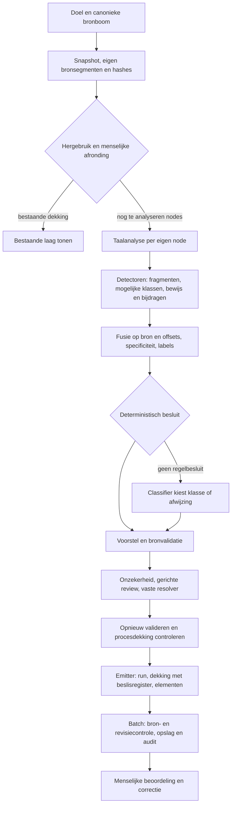

# Annotatieketen en tekststructuur — 29 september 2026

Deze kaart beschrijft de geïmplementeerde keten en het afzonderlijke vergelijkingspunt
na de [detectoraudit](hybrid-v1-detector-audit.md). Het betreft een technische verbetering
van tekstgrenzen, structuur en herkomst. Classifierprompts, juridische herkenningsregels,
klassenvoorrang en resolverbeleid zijn niet veranderd. Er is geen uitrol of databasemigratie.

## Ketenkaart



Paden in onderstaande tabel zijn relatief aan
[`tools/graph-qa/agent`](../../tools/graph-qa/agent).

| Stap / code | Ontvangt en voegt toe | Filtert of beslist | Zichtbaarheid en herstel later |
|---|---|---|---|
| Bronophaling — `nodes/annotatie.py`, `bron_annotatie.lees_bron`, `bronmodel.resolve` | Doel → canonieke boom, snapshot-ID, node-IRI, eigen tekst, SHA256 en corpusmapping | Selecteert de aangewezen node/subboom; UI-opmaak bepaalt geen bronoffsets | Bronfouten stoppen de beurt. De keten kan een verkeerde of gewijzigde bron niet repareren. |
| Hergebruik — `bron_annotatie.controleer_hergebruik` | Snapshot + bestaande dekking/lagen → hergebruikte nodes | Volledig hergebruik slaat de detectieketen over. Geaccordeerde nodes worden uitgesloten; opnieuw annoteren overschrijft geen menselijke afronding | Hergebruik heeft eigen events/runmodus. Bij ontbrekende dekking volgt nieuwe analyse; geen stil gemengde bronversies. |
| Taal — `jas_pipeline/keten._bronteksten`, `taal/provider.py` | Eigen tekst per node en oudertekst als apart contextveld; tokens, zinnen, lemma's, POS, dependencies en providerversie | Volledige parsers bepalen hun eigen zinnen/dependencies. Bij ontbreken/falen: alleen tokens en gedeelde zinsgrenzen | `niveau=TOKENS`, `fout`, `meting.gedegradeerd`, overslagredenen en een gebruikerswaarschuwing. Latere modellen herstellen ontbrekende parse niet. |
| Detectie — `jas_pipeline/detectoren/*` | Tekst/context/analyse → exacte spans, alternatieve spans, mogelijke klassen, bewijs, oorspronkelijke bijdragen | Detectoren bepalen fragmentgrenzen en hypotheseruimte; verwijzingsmaskers onderdrukken interne treffers. Geen juridische acceptatie | Nul treffers is uitgevoerd, geen bewijs van afwezigheid. Ontbrekende parse is expliciete overslag. Resultaatidentiteit wordt tegen de uitgevoerde detector gecontroleerd; technische fouten stoppen de beurt. Maskeronderdrukking is nog geen kandidaat en krijgt geen kandidaatbesluit. |
| Fusie — `fusie.py`, `specificiteit.py` | Alle resultaten → één kandidaat per bron/offsetpaar, bewijsunie, klassenunie, opties, overlaprelaties, labels | Overlap/nesting blijft bestaan. Specificiteit beperkt klassen of wijst af; oorspronkelijke bijdragen blijven apart intact | Kan exact gelijke spans combineren, maar geen afgebroken span verlengen en geen gemiste kandidaat terugvinden. |
| Besluit — `besluit.py`, `classificatie.py` | Kandidaat/bewijs/klassen → vaste regelbeslissing of modelkeuze via label | Classifier kiest uitsluitend aangeboden klasse of `Geen annotatie`. Spankeuze staat standaard uit; aan betekent uitsluitend keuze uit bestaande opties | Ontbrekende/ongeldige modelkeuze wordt `UNCERTAIN` met code, geen verzonnen fragment. Een ontbrekende klasse of grens kan het model niet toevoegen. |
| Eerste validatie — `validatie.py`, `keten._voorstel` | Beslissingen + corpusmapping + snapshot → brongetrouwe voorstellen en bevindingen | Controleert onder meer ankers, klasse, provenance en dubbele functies; fouten verwijderen voorstellen en zetten besluit op `REJECTED` | Foutcode blijft in meting/besluit. Controle kan fouten weren, niet tekst of offsets gokken. |
| Review — `onzekerheid.py`, `review.py`, `resolver.py` | Concrete conflicten/abstain → gericht oordeel en geregistreerde transitie | Reviewer kiest KEEP/CHANGE/HUMAN_REVIEW; resolver voert de vaste tabel uit. Gedegradeerde parse gaat zonder tweede model naar de jurist | Kan een klassekeuze herstellen binnen bestaande alternatieven. Geen nieuwe kandidaat, span of juridische herkenningsregel. |
| Tweede validatie en dekking — `keten.py`, `dekking.py` | Gewijzigde voorstellen opnieuw door dezelfde controles; één eindbesluit per kandidaat | Geen kandidaat mag `UNHANDLED` blijven; structurele dekking vermeldt uitgevoerde/overgeslagen dimensies en ongedekte tekst | Onvolledige procesdekking is een fout. Structurele dekking is geen juridische recall. |
| Registratie en emitter — `beslisregister.py`, `nodes/annotatie.py` | Runmeting, voorstellen, besluiten en ruwe bijdragen → run/dekking/element-events | Alleen voorstellen worden elementen; afgewezen kandidaten blijven in het beslisregister met bewijs, klassen en bijdragen | Bewijsfingerprint blijft gelijk gedefinieerd. Detectorversies staan bij bijdragen en detectorresultaten; de oorspronkelijke modelreden blijft beschikbaar na resolvertransities. |
| Opslag — `beurt.py`, API `annotatie_v2_store.batch` | Batch met snapshot, revisies, elementen, run, dekking en beslisregister | Valideert scope/ankers opnieuw; idempotente transactie, geen overschrijven van menselijke historie | Snapshot-/revisieconflict geeft fout. Elementen bewaren trace, batch-audit bewaart ook afwijzingen en bijdragen. Bestaande dictionaryvelden bewaren extra meting zonder migratie. |
| Mens — API `annotatie_v2_store.beslis`, frontend `components/annotaties/NodeAnnotatiePaneel.tsx` | Voorstellen, alternatieven, bron en historie | Goedkeuren, afwijzen, corrigeren, heropenen; actor en revisie worden geregistreerd | De menselijke correctieroute kan een verkeerde klasse of span herstellen. Ontbrekende detectie blijft een inhoudelijke beoordelingsvraag, geen automatisch herstelde recall. |

Onverwachte exceptions (ook een geschonden detectorcontract) komen via `agent.answer_stream`
als gesaniteerd `error`-event naar de gebruiker; de volledige fout staat in het log. Er wordt
dan geen succesvolle detectiemeting of set annotaties gefingeerd.

## Gedeelde voorzieningen

[`taal/grenzen.py`](../../tools/graph-qa/agent/jas_pipeline/taal/grenzen.py) modelleert
beschermde `Bereik`-objecten en aparte zins-/segmentgrenzen met codepointpositie en reden.
Verwijzingen, numerieke notaties, afkortingen en onderdeelnummering worden eerst herkend.
Daarna sluiten `. ! ?` een zin en segment af; `; :` alleen een segment. Een gewone
regelovergang kan tekstomloop zijn, een lege regel is een alineagrens. De NormDetector
gebruikt segmenten als kern en zinnen als optie; de terugvalprovider gebruikt de zinnen.
Volledige parseranalyses worden niet aangepast.

[`taal/verwijzingen.py`](../../tools/graph-qa/agent/jas_pipeline/taal/verwijzingen.py) bevat
de gemeenschappelijke verwijzingspatronen. De bestaande masker-YAML verwijst ernaar via
`herkenner`, met behoud van regelidentiteiten en tests. Ook puntnummers zoals `artikel 9.1`
vallen nu volledig binnen het masker. Grensbescherming en kandidaatonderdrukking zijn
afzonderlijk: de duizendpunt in `€ 1.000` is beschermd, terwijl het bedrag kandidaat blijft.
Een afsluitende punt na een bedrag of artikelnummer hoort niet bij het beschermde bereik.

[`taal/structuur.py`](../../tools/graph-qa/agent/jas_pipeline/taal/structuur.py) ontvangt
eigen tekst, oudercontext en het inhoudelijke aanhefpatroon van de detector. Een zoekvenster
begint na de eigen aanhef, of bij bronstart als de aanhef alleen in de ouder staat. De volgende
aanhef of het node-einde sluit dat venster. Nummering begrenst onderdelen ook op één regel;
een ongenummerd vervolglid vereist een regelstart na een puntkomma. Omschrijvingen mogen over
regels doorlopen en interne dubbele punten/puntkomma's bevatten. `_Venster.bereik` vertaalt
zoekposities centraal terug naar uitsluitend eigen bronoffsets. De detectoren houden hun
eigen aanhefvoorwaarden, bewijscodes en klassen.

[`detectoren.resultaat`](../../tools/graph-qa/agent/jas_pipeline/detectoren/__init__.py)
neemt naam/versie uitsluitend van het detectorobject over, voor treffers, nul treffers en
overslag. Alle productie-detectoren gebruiken deze constructie. Zonder interne regelmerge
worden ruwe bijdragen hier vastgelegd; regeldetectoren leveren hun bijdragen van vóór die
merge aan. Fusie en beslisregister bewaren ze ook bij afwijzing. De uitvoerder controleert
resultaatnaam, versie, bron, bewijsidentiteit, bijdrage-identiteit en geldige overslag.

Norm, definitie en betekenis hebben versie **2**. Detectoren die verwijzingsmaskers gebruiken
registreren daarnaast `+verwijzing.2` in hun versie; declaratieve regelversies veranderen
niet. De logische detector blijft versie 2 en rapporteert die nu ook bij overslag.
De bestaande runmeting bevat `tekstgrenzen_versie=1`, `tekststructuur_versie=1`,
`verwijzingen_versie=2` en per detector/node de versie, aantallen, overslagstatus en reden.
Deze structuurtypen blijven intern; publieke annotatiecontracten blijven gelijk.

## Acceptatiegevallen en beperkingen

| Geval | Voor | Na / bewijs |
|---|---|---|
| `Hij moet volgens artikel 3:4 € 1.000 betalen.` | Norm eindigde bij `artikel 3` | Volledige norm; dezelfde bescherming werkt voor `artikel 9.1` en `art. 4`. `test_norm_en_terugval_splitsen_geen_notatie_en_behouden_volgende_zin` test beide woordvolgordes en een echte volgende zin. |
| `In deze wet wordt verstaan onder: a. aanvraag: het verzoek; b. besluit: de beslissing.` | Geen definitieonderdelen op dezelfde regel | Twee Brondefinitie-kandidaten, met oorspronkelijke offsets. Dezelfde structuur wordt getest met regeleinden en afzonderlijke kindnodes; betekenisregels behouden Voorwaarde/Rechtsobject. |
| Bijzin/nominalisatie/logisch zonder parse | Resultaat hardcoded versie 1, ook bij detectorversie 2 | Resultaat en bijdragen volgen het detectorobject. Tests dekken ontbrekende parse, gedegradeerde parse, succesvolle nulmeting en geweigerde identiteitsdrift. |

Zie [laagtests](../../tools/graph-qa/tests/test_tekststructuur.py) en
[ketentests](../../tools/graph-qa/tests/test_tekststructuur_keten.py). De ketentests gebruiken
nepmodellen voor acceptatie, abstain gevolgd door review, en afwijzing. Ze controleren
classifierinvoer, uitvoerankers, validatie, bijdrageversies en beslisregistratie.

De deterministische grensanalyse is geen algemene Nederlandse zinsparser. Afkortingen zijn
een begrensde lijst; bij een mogelijke slotafkorting helpt de hoofdletter van het volgende
woord. De structuurherkenning modelleert vlakke onderdelen, geen volledige geneste juridische
documentgrammatica. Zonder nummering, nodegrens of voldoende regelstructuur worden interne
omschrijvingen niet willekeurig op dubbele punten gesplitst. Overige detectoren behouden hun
eigen patroon- en dependencygrenzen. De [uitgestelde auditpunten](hybrid-v1-detector-audit.md)
over juridische context, generic NP en relationele modellering blijven open.

## Vergelijking en verificatie

De [voormeting](metingen/hybrid-v1-tekststructuur-2026-09-29/voor.json) is gemaakt op schone
commit `32faeaec9a470561b7f118c121725736237c1f4c`, vóór implementatie. De
[nameting](metingen/hybrid-v1-tekststructuur-2026-09-29/na.json) bevat de vergelijking en
hashes van de gewijzigde bestanden. Beide gebruiken dezelfde 16 ontwikkelcasussen en twee
historische diagnostische bronnen, echte spaCy-parse en **nul modelaanroepen**. De eerdere
freeze, referentieset en meetbestanden blijven ongewijzigd.
De [controle-uitvoer](metingen/hybrid-v1-tekststructuur-2026-09-29/controle.json) bevat de
exacte testcommando's, vier optieverschillen en controle van de ongewijzigde freeze-bestanden.

| Ontwikkelset | Voor | Na |
|---|---:|---:|
| Samengevoegde kandidaten | 262 | 262 |
| Kernankers met klasse / provisional ankers | 73/81 | 73/81 |
| Ankers inclusief opties | 75/81 | 75/81 |
| Regelbesluiten | 19 | 19 |
| Classifierkandidaten / universele batches | 243/16 | 243/16 |

Alle kernspans, klassen, bewijscodes, routes en classifierinvoer blijven gelijk voor alle 18
bronnen. Alle volledige parses blijven gelijk. Uitsluitend vier alternatieve zinspans veranderen:

| Casus | Normfragment | Zinoptie voor → na |
|---|---|---|
| RVV01 | voetgangers mogen oversteken; | `[36,78)` → `[0,78)` |
| RVV02 | voetgangers mogen oversteken; | `[36,124)` → `[0,124)` |
| RVV03 | voetgangers mogen niet meer beginnen over te steken; | `[36,166)` → `[0,166)` |
| RVV03 | reeds overstekende voetgangers moeten zo snel mogelijk doorlopen. | `[36,166)` → `[0,166)` |

Die opties omvatten nu ook de aanhef: een regelovergang is geen zelfstandig zinseinde meer.
Omdat `classifier_spankeuze=false` is er geen verandering in classifierinvoer of routing.
Detectorversies veranderen zoals hierboven beschreven; de onderliggende oorspronkelijke
bijdragen blijven behouden. De drie acceptatiefouten zaten niet in deze ontwikkelset en
worden daarom afzonderlijk door de nieuwe regressies bewezen. Dit is geen meting van
juridische precision, recall of modelkwaliteit; daarvoor blijft een beoordeelde testset nodig.

Controle: **387 graph-qa-tests geslaagd**, inclusief detectoren, taalproviders, fusie,
freeze-regressies, hybride keten, nieuwe regressies, herkomst, validatie, resolver, dekking,
bronnodeketen en hergebruik; daarnaast **30 API-opslagtests geslaagd** met SQLite, inclusief
roundtrip van detectiebijdragen en afgewezen kandidaten. Geen PostgreSQL-integratierun gedaan.

Reproductie vanuit `tools/graph-qa` (schrijf naar een nieuw bestand):

```bash
.venv/bin/python -m eval.detector_audit --json /tmp/tekststructuur-audit.json --vergelijk ../../docs/architectuur/metingen/hybrid-v1-tekststructuur-2026-09-29/voor.json
.venv/bin/python -m pytest tests/test_tekststructuur.py tests/test_tekststructuur_keten.py -q
```
