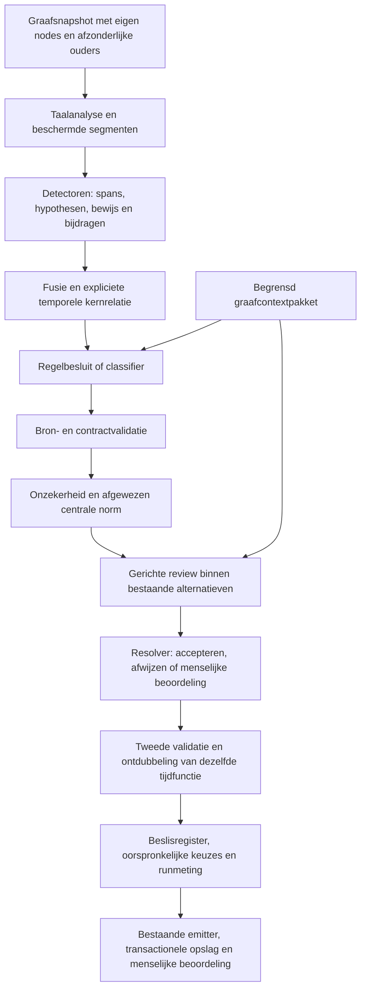

# Invorderingsonderzoek: implementatie en vergelijking

De bevindingen uit het [onderzoek van 29 september](../wetsanalyse/onderzoek-invordering-2026-09-29/README.md)
zijn verwerkt in een afzonderlijke ontwikkelversie. De implementatie omvat fragmentgrenzen,
termijnfuncties, gerichte herbeoordeling en expliciete graafcontext. De dertien publieke
JAS-klassen en annotatie-/opslagcontracten blijven gelijk. Er is geen migratie of uitrol.

De oorspronkelijke onderzoeksbestanden, freeze en referentieset v1 blijven ongewijzigd.
Nieuwe resultaten staan in een [afzonderlijke meetmap](metingen/hybrid-v1-invordering-vervolg-2026-09-29/README.md).
Dit document vervolgt de eerdere [ketenkaart voor tekststructuur](hybrid-v1-annotatieketen.md).

## Aanvulling: baseline 29 september 2026

Deze versie is vóór de nulmeting verder aangescherpt en vormt samen met vijf uitgestelde
auditpunten de [nieuwe baseline](metingen/hybrid-v1-baseline-2026-09-29/README.md). Wat
daardoor anders is dan hieronder beschreven:

- **Context in productie.** `broncontext` (standaard aan) bepaalt of `BronContext.ouders` wordt
  meegegeven. Context staat als eigen `CONTEXT`-blok ná de afgesloten bepaling, niet erbinnen.
  Een ouderpassage met afwijkende hash wordt als ontbrekend gemeld in plaats van de annotatie te
  stoppen. Het productiemechanisme levert alleen een passage als de oudernode eigen tekst heeft:
  bij de onderzochte wetsartikelen is dat niet zo, bij de Leidraad wel. De C-variant van de
  vorige proef (samengesteld pakket van achttien passages) meet dus niet het productiegedrag.
- **Functiedetector.** Passieve toewijzing en toepassingskeuze worden op dependencies getoetst:
  een grootheid als lijdend onderwerp met een `op`-bepaling; een toepassingskeuze onder een
  voorwaarde, niet ontkend en niet `overeenkomstige toepassing`.
- **Tijdkern.** `TEMPORAL_KERNEL` verwijst naar de ouder en kopieert geen detectorbewijs meer
  (fusie v3), zodat een bijdrage nooit een treffer suggereert die de detector niet deed.
- **Auditpunten D01, D03–D06**: normcontext bij generieke NP, Rechtsfeit alleen met rechtsgevolg,
  nominalisatie alleen bij handeling, afgeleide bewijssterkte en sterk bewijs boven generiek
  NP-bewijs. Zie de [detectoraudit](hybrid-v1-detector-audit.md).

## Bronbeleid en afbakening

De vier hoofdgevallen zijn IW 9 lid 1, IW 9 lid 5 en Leidraad Invordering §9.1 en §9.5.
De Leidraadpassages zijn beleidsteksten, geen leden van artikel 9 van de wet. Alle doel-
en contextteksten van de modelproef komen uitsluitend uit de bestaande graaf, met exacte
tekst, bron-IRI, hash, toestand en juridische status in het bevroren bronpakket.
Tijdens de modelruns vindt geen bronophaling plaats. Internet levert geen juridische
bron- of contexttekst voor deze vergelijking.

De vier controles zijn IW02 (IW 36 lid 1), AWB04 (Awb 4:17 lid 2), Awb 4:17 lid 1 en IW04
(IW 34 lid 6). De laatste twee vervangen, met toestemming van de gebruiker, WZT01 en RVV03:
die regelingen ontbreken in de graaf. De vervangers toetsen respectievelijk een maximale
termijn en delegatie die niet als berekening mag worden behandeld. Dit is geen inhoudelijk
identieke vervanging van de oude controles; de vergelijking blijft acht gevallen × drie
varianten × drie herhalingen = **72 primaire pogingen**.

De huidige graafteksten van controles kunnen afwijken van historische ontwikkelfixtures.
Daarom worden hun oude referentieannotaties niet als gold op de nieuwe teksten toegepast.
De bevroren zestien ontwikkelfixtures dienen uitsluitend als bestaande regressiecontrole.

De Awb-regelingwortel in de graaf bevat tegenstrijdige bronboomgegevens. De onderzoekslezer
haalt daarom de exact geïdentificeerde artikel-/lidnodes en hun ondubbelzinnige ouders op.
Het pakket vermeldt `gerichte_graafnodes_geen_volledige_bronboom`; er wordt geen volledige
canonieke boom voorgewend. De productieresolver en de graaf zijn niet aangepast.
Voor de uitvoering sluit de onderzoekssnapshot de hoogste geselecteerde ouder als lokale
wortel af. Zijn oorspronkelijke graafouder blijft apart geregistreerd. Tijdens de eerste
ronde ontbrak deze afbakening bij elf controlepogingen; hun bewaarde reacties zijn na herstel
opnieuw gevalideerd met exact dezelfde modelverzoeken en kandidaten, zonder nieuwe calls.
De oorspronkelijke bestanden en de correctie blijven beide zichtbaar in de meetmap.

## Verantwoordelijkheden in de gewijzigde keten

| Stap | Ontvangt en voegt toe | Beslissingsruimte en herstelgrens |
|---|---|---|
| Bronophaling en hergebruik | De bestaande resolver levert eigen node-tekst, hash en corpusmapping; bestaande menselijke afronding blijft beschermd. | Ontbrekende/tegenstrijdige bron stopt de bronophaling. Geen webterugval. Volledig hergebruik voert geen nieuwe detectie uit. |
| Taal en declaratieve afleiding | `Regel.bereik=segment` vertaalt zoekposities centraal terug naar eigen offsets. De gedeelde grensvoorziening beschermt verwijzingen, bedragen en afkortingen. | De volledige parser houdt zijn eigen dependencystructuur. Grenzen worden niet achteraf aan die boom opgelegd. |
| Functie-/tijddetectie | Kandidaten voor datumtoewijzing, aantalberekening, kalenderpositie, relatieve datum, elliptische voorwaarde en toepassingskeuze. | Dit zijn hypothesen met bewijs. Een volledige parse is vereist voor de functiedetector; overslag blijft zichtbaar. Er ontstaat geen impliciete partij of verzonnen datum. |
| Fusie | Combineert gelijke bron/offsetparen; bewaart iedere oorspronkelijke detectorbijdrage. Een al bestaande kandidaat op een exact geregistreerde tijdkern krijgt T als extra hypothese en een verwijzing naar de langere kandidaat. | Overlap alleen is onvoldoende. Fusie verlengt geen ontbrekende fragmenten. Specificiteit blijft afzonderlijk herkenbaar in het bewijs. |
| Classifier | Exacte toegestane klasseverzameling per batch in de nieuwe proefmodus; doeltekst en contextpakket blijven afzonderlijk gelabeld. | Keuze uit bestaande klasse of afwijzing. Geen nieuwe span, klasse, partij of contextanker. Ongeldige antwoorden blijven technische onzekerheid. |
| Onzekerheid/review | Herbeoordeelt een afgewezen enige centrale norm wanneer RO/T-voorstellen overblijven. Bewaart de oorspronkelijke afwijzing, reden en resterende voorstellen. | Hoogstens één centrale herbeoordeling per normeenheid. KEEP bevestigt afwijzing; CHANGE kiest een toegestane klasse; HUMAN_REVIEW laat de keuze open. Ontbrekende aangevraagde context gaat rechtstreeks naar de mens. |
| Resolver/validatie | Legt transitie en motivering vast; valideert gewijzigde voorstellen opnieuw. Bij zowel korte als lange geaccepteerde T voor dezelfde expliciet geregistreerde functie blijft de lange hoofdspan. | Een ongeldige reviewreactie geeft menselijke beoordeling, geen automatische eerste inhoudelijke keuze. De klasse op zo'n geel voorstel is slechts de voorlopige weergave die het bestaande contract vereist. |
| Registratie/opslag/mens | Runmeting bewaart alle oorspronkelijke keuzes, context, schema-/prompthashes, bijdragen en ontdubbeling. De bestaande emitter en opslag verwerken dezelfde publieke vormen. | Ook afwijzingen blijven raadpleegbaar. De menselijke route kan klasse/span corrigeren; procesdekking is geen bewijs dat alle juridische functies zijn gevonden. |

De runtime maakt alleen context van al beschikbare ouders (`BronContext.ouders`). Hij haalt
niet zelf andere wetsartikelen op. De C-variant krijgt het vooraf geselecteerde onderzoeks-
pakket expliciet mee. `BronContext` accepteert maximaal twintig unieke graafpassages,
controleert teksthashes en houdt ontbrekende aangevraagde context zichtbaar. Deze controle
vervangt niet de betrouwbaarheid van de aanleverende graaflezer: het veld `herkomst=graaf`
is een intern contract, geen cryptografisch bewijs van ophaling.

## Acceptatie en code

Codepaden hieronder zijn relatief aan `tools/graph-qa/agent/jas_pipeline`.

| Ontwerp | Implementatie | Regressiebewijs |
|---|---|---|
| A01: datum zonder jaar | `regels/tijd.yaml`, `detectoren/regels.py`: kalendercontrole, ontbrekend jaar blijft onbekend; 29 februari mogelijk zonder bekend jaar | `test_invordering_verbeteringen.py`: geldige/ongeldige datums, Unicode-spaties, verwijzingen en echte zinseinden |
| A02/A03: toewijzing, aantal en bereik | `detectoren/functies.py`: benoemde grootheid en passieve volgorde; `zoveel … als … overblijven/resteren`; governor bij elliptische voorwaarde; afzonderlijke terugverwijzende toepassingskeuze | Graafgevallen §9.1/lid 5 plus gewone handeling, delegatie en vergelijking als negatieve controles |
| A04: temporele functiegrens | `detectoren/syntactisch.py`: zelfstandige/distributieve vervolguitspraak buiten nominalisatie; `functies.py`: complete relatieve datum; tijdregels voor maand en herhaling | C026 lid 5 begrensd; nominale nevenschikking blijft intact; datumomschrijving en `telkens … later` bereikbaar |
| A05: kernhypothese | `fusie.py`, `besluit.ontdubbel_tijd`: expliciete kernrelatie, bijdrage met fusieversie, uitsluitend geaccepteerde T ontdubbelen | Kern versus louter overlap; oorspronkelijke bijdragen; geen dubbele korte/lange T in uitvoer |
| A06: centrale afwijzing | `onzekerheid.centrale_afwijzingen`, `review.py`, `resolver.py`, `reviewload.py` | KEEP, CHANGE, HUMAN_REVIEW, ongeldige actie, ontbrekende motivering/context; oorspronkelijke afwijzing blijft behouden |
| A07: gericht bronpakket | `broncontext.py`, `keten.py`, `nodes/annotatie.py`; beperkte aanvullende classifier-/reviewinstructies | Context bereikt iedere modelbatch maar wordt geen annotatiedoel; gewijzigde tekst of XML-herkomst geweigerd |
| A08: contracten | `classificatie.batches`, `review.beoordeel`: modus `klasseverzameling`; tweede validatie blijft bestaan | Classifierenum is exact de toegestane verzameling; technisch ongeldige review blijft zichtbaar |
| A09: afleidingsgrenzen | `detectoren/regels.py`, `regels/afleiding.yaml`: gedeelde segmenten, lokale offsetterugvertaling | `artikel 3:4`, `artikel 9.1`, `€ 1.000`, echte volgende zinnen en puntkomma's |
| A10: vergelijking | `eval/invordering_bronnen.py`, `invordering_proef.py`, `invordering_rapport.py` | Bronhashes, precies 72 primaire pogingen, onveranderlijke code-/bronmanifesten, volledige voorstellen en verdwenen elementen |

De concrete tests staan in [detectie](../../tools/graph-qa/tests/test_invordering_verbeteringen.py),
[beslisketen](../../tools/graph-qa/tests/test_invordering_beslisketen.py) en
[meetharnas](../../tools/graph-qa/tests/test_invordering_proef.py). De bestaande detector-,
taalprovider-, fusie-, freeze-, hybrideketen- en API-tests blijven onderdeel van de controle.

## Versies en proefinstellingen

Baseline **b8117e2** bevat de oorspronkelijke productieketen en bevroren onderzoeksvoorziening.
Verbeteringen: **b190841** (grenzen/datums), **4fb25f5** (termijnfuncties/fusie),
**a0699a5** (beslisketen en modelproef). Per fase is een afzonderlijk meetbestand bewaard.
De uiteindelijke offline meting `04-bevroren-keten.json` is op a0699a5 gemaakt; de eerdere
`03-beslisketen.json` is een tussenmeting vóór de aanvullende toepassingskeuze.

De functiedetector start op versie 1, nominalisatie is versie 3, fusie versie 2.
Gewijzigde datum-/periode-/afleidingsregels dragen regelversie 2; afleiding registreert ook
`+grenzen.1`. De runmeting bevat daarnaast grensversie 1, structuurversie 1 en verwijzingsversie 2.
Prompts en schemas worden gehasht, inclusief de feitelijk aangeboden context. Gegenereerde
verklaringen zijn bijgewerkt; er zijn geen nieuwe publieke klassen.
De tijdens de proef herstelde snapshotafbakening betreft uitsluitend het meetharnas;
applicatiecode, bronteksten, directe oudercontext en modelverzoeken zijn gelijk gebleven.

De nieuwe batchmodus is expliciet ingesteld in B/C; de standaardconfiguratie blijft
`universeel`. Alle varianten gebruiken `claude-sonnet-4-6`, dezelfde provider, vaste
kandidaatgrenzen, volledige spaCy-parse, ingeschakelde gerichte review en deterministische
acceptatie. Temperature wordt niet meegestuurd; SDK-retries staan op nul en timeout op
60 seconden. Classifierbudgetten volgen dezelfde formule per batch. De reviewer heeft in
B/C meer ruimte voor de nieuwe verplichte motivering (256 + 160 per geval in plaats van
256 + 64, beide maximaal 8.000 tokens). Exacte batches veranderen dus ook het aantal
aanvragen en de effectieve budgetten; dit wordt als onderdeel van de gecombineerde
B-variant gemeten. C versus B is uitsluitend de toegevoegde contextfactor.

## Grenzen van de uitkomst

De functiedetector gebruikt begrensde grammaticale en lexicale patronen, geen algemene
juridische redeneerder. Een parse vereisen maakt zo'n patroon niet vanzelf juridisch juist.
De centrale-afwijzingscontrole signaleert alleen de beschreven lokale situatie: zonder
normkandidaat of zonder resterend RO/T-voorstel kan hij geen ontbrekende norm ontdekken.
De aanvullende context is geselecteerd en begrensd, niet automatisch volledig.

De 60 conceptpunten uit het onderzoek blijven voorstellen, open vragen, samenhangspunten
en uitsluitingen; zij zijn geen 60 vereiste annotaties. Relaties tussen normen, partijen,
voorwaarden en berekende waarden blijven een afzonderlijk conceptdossier, zonder nieuwe
publieke relationele opslag in deze ronde. Juridische kwaliteitswinst vereist beoordeling
van de volledige uitvoer, inclusief verdwenen voorstellen en nieuwe foutieve acceptaties.
