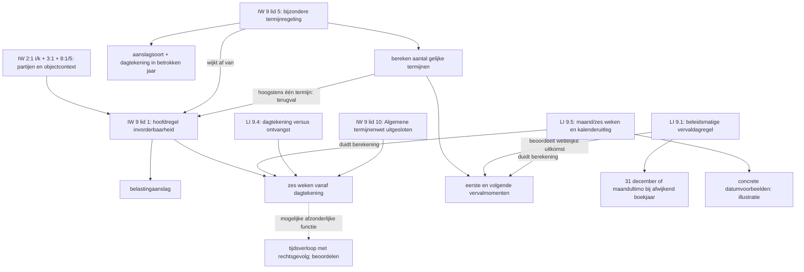

# Verbeterontwerp en acceptatie

Dit is het opgeleverde ontwerp voor een volgende implementatiestap. De onderzoeksronde implementeert de meetvoorziening en tests, niet onderstaande nieuwe juridische herkennings- of beslisregels. Uitrol en wijzigingen van publieke API's, opslag en werkplek vallen erbuiten.

## Geprioriteerde wijzigingen in de huidige annotatieketen

Per onderdeel eerst een afzonderlijke ontwikkelmeting maken. Detector-/regelversies verhogen bij gewijzigd gedrag; prompts en instellingen hashen. Bron, oorspronkelijke bijdragen en afgewezen keuzes blijven behouden.

| Acceptatie / prioriteit | Concreet ontwerp | Bewijs en verwacht effect | Negatieve toets / risico |
|---|---|---|---|
| **A01 / P1 – datums zonder jaartal** | Breid datumherkenning uit tot dag + maand met optioneel jaar. Bewaar ontbrekend jaar als onbekend; geen datum aanvullen. Valideer dag/maandcombinatie; zonder jaar blijft 29 februari mogelijk. Gebruik bestaande verwijzingsmaskers en tijdsvoorzetsels. | I02: §9.1 beide voorkomens van 31 december afzonderlijk met T; §9.5 datumvoorbeelden beschikbaar. | `31 februari`, losse artikel-/publicatienummers en `artikel 9.1` leveren geen datum. Volledige datum met jaar, Unicode-spaties en een volgende zin blijven juist begrensd. Voorbeeldstatus wordt niet als normstatus geïnterpreteerd. |
| **A02 / P1 – grammaticale toewijzing** | Herken passieve toewijzing via predicaat en complement: `wordt gesteld op X` én `wordt X op Y gesteld`. Bied de betekenisdragende clausule als AR-hypothese aan, inclusief genoemde uitkomst. Combineer werkwoordpatroon met benoemde grootheid/datum; `wordt` alleen is onvoldoende. Houd lexicale terugval zonder parse beperkt en zichtbaar. | I03: beide zinnen van §9.1 krijgen een bereikbare centrale hypothese. Classifier bepaalt de juridische klasse; geen automatische RB. | Variatie met bepaling/voorwaarde ertussen, actieve vorm als aparte controle; gewone handeling `Het boek wordt op tafel gelegd` en delegatie `worden regels gesteld` worden geen rekenregel. |
| **A03 / P1 – berekening en toepassingsbereik** | Voeg een structurele hypothese toe voor `zoveel … als …` met een berekende uitkomst en invoer. Neem beperkende relatieve bijzinnen en elliptische voorwaarden zoals `Bij afwijkende boekjaren` op met hun governor/hoofduitspraak als interne context. Bewaar een terugverwijzende keuzeregel afzonderlijk van de berekening. | I04: aantal termijnen in lid 5 als AR beschikbaar; kwalificatie dagtekening en terugval naar lid 1 blijven verbonden. | Vergelijkend `als` niet als losse VW; `niet … meer dan één termijn` behoudt negatie. Taxonomische opsomming van aanslagsoorten wordt niet automatisch logische voorwaarde. |
| **A04 / P1 – temporele functiegrenzen** | Maak complete relatieve datums beschikbaar (`de laatste dag van de maand`, `de dag die …`). Bepaal bij nominalisatie een eigen functiegrens vóór een zelfstandige/distributieve vervolguitspraak; gebruik geen algemene stop op `en`. Een korte duurkern en lange termijnspan blijven alternatieve grenzen voor dezelfde functie. | I06/I07: C026 lid 5 bevat geen tweede termijnregel; §9.5 kan een beschreven datum kiezen; `telkens … later` behoudt herhaling en referentiepunt. | `na de verzending en de bekendmaking` blijft samen mogelijk. Volgende zin blijft apart. Vergelijkend `als dat van …` komt niet terug als VW. Optie alleen telt niet als beschikbare hoofdspan zolang spankeuze uit staat. |
| **A05 / P2 – hypothesen en fusie** | Houd bewijs per bijdrage betrokken bij klassekeuze. Als een bestaande korte kandidaat exact de geregistreerde temporele kern van een langere kandidaat is, onderzoek een expliciete T-hypothese met verwijzing naar die bijdrage. Los de keuze tussen één lange annotatie en een korte variant als alternatieven op, niet als automatische dubbele uitvoer. | I05: `zes weken` heeft geen overgebleven RO/RS-keuzeruimte zonder T. Een generieke NP drukt specifiek bewijs niet weg. | Geen T erven door overlap alleen; een bedrag binnen een periode blijft bedrag. Een tijdsverloop met afzonderlijk rechtsgevolg wordt niet door tijd/parameterprioriteit verwijderd. Generieke NP-detectie niet globaal uitschakelen: bestaande audit toont verlies van ontwikkelankers. |
| **A06 / P1 – centrale afwijzing zichtbaar maken** | Voeg eerst diagnostiek toe wanneer een afgewezen normkandidaat met normbewijs de enige centrale hypothese in haar normeenheid is, terwijl object-/tijdvoorstellen resteren. Noteer kandidaat, bewijs en welke samenhang ontbreekt. Voor de ontwikkelproef routeert dit maximaal één gerichte beoordeling per normeenheid; zonder toereikende context naar menselijke beoordeling. Laat afwijzing een geldige uitkomst blijven en registreer een korte grond en gebruikte context. | I01/I09: de ontbrekende invorderbaarheidsduiding in lid 1 blijft zichtbaar. Geen claim dat normbewijs de juiste klasse al bewijst. | Beschrijvende tekst en terecht afgewezen kandidaten blijven afwijsbaar. Niet alle REJECTED-kandidaten naar een model sturen. Een tweede modelreactie is geen expertvaststelling. Meet nieuwe foutieve acceptaties en reviewlast. |
| **A07 / P2 – gericht bronpakket en instructies** | Geef doeltekst, geselecteerde context, bron-ID, toestand, wet/beleid en voorbeeldfunctie afzonderlijk mee. De classifier kiest alleen doelkandidaten. Voeg beperkte instructies toe over centrale norm, temporele functie, impliciete partijen en voorbeeldstatus; geen volledig boek in de prompt. Log welke context werkelijk is aangeboden en ontbreekt. | E01–E13: onderscheid tussen lid 1, afwijking lid 5, §9.1-toewijzing en §9.5-uitleg. | Context wordt niet vastgeplakt aan de bronnode; geen anker buiten eigen node. Geen context op basis van internet als graaf ontbreekt. Onbekend jaar of partij blijft onbekend. |
| **A08 / P2 – contractfout afzonderlijk behandelen** | Behoud per-kandidaatvalidatie. Proefvariant: groepeer batches op exact dezelfde toegestane klasseverzameling, met behoud van volledige broncontext. Classifier en reviewer apart toetsen. Houd technische contractfout, geldige afwijzing en inhoudelijke onzekerheid als afzonderlijke meetcategorieën. | I08: batchschema staat geen klasse toe die bij een kandidaat al is uitgesloten. De bestaande rapportage van ruwe reviewreacties blijft behouden. | Meet kosten en verlies van kandidaatcontext door splitsing. Een model dat T wil waar alleen RO/V/RS bestaat wijst mogelijk op detectieverlies; batching alleen lost dat niet op. Geen automatisch eerste alternatief als inhoudelijk oordeel behandelen. |
| **A09 / P1 – gedeelde grenzen voor afleiding** | Laat ook afleidingsdetectie haar zoekbereiken ontlenen aan de gedeelde beschermde grenzen. Verwijder concurrerende punt-/dubbelepuntgrenzen uit de zoekvensters; patroonherkenning blijft inhoudelijk gelijk. Bewaar lokale offsets. | I10: geen splitsing in `artikel 9.1`, `3:4` of `€ 1.000`. | Echte volgende zin blijft apart; zelfde test bij bedrag aan zinseinde. Meet wijzigingen buiten deze casussen, want declaratieve regexpatronen kunnen elders ander bereik krijgen. |
| **A10 / P1 – blijvende onderzoekscontrole** | Bewaar bronpakket, conceptstatus en voor/na-metingen gescheiden. Test kandidaatbereik én intact transport via classificatie, validatie, review en uitvoer. Vergelijk per bron+offset+functie, niet op verschuivende C-labels. | De huidige offline meetvoorziening en 17 tests zijn uitgevoerd. | Geen juridisch gold afleiden uit succesvolle technische tests; nieuwe hypothesen niet stil in referentieset v1 schrijven. |

P1 betekent eerst onderzoeken/implementeren in een afzonderlijk ontwikkelvoorstel; het is geen toestemming om alle wijzigingen tegelijk in productie aan te zetten. Technische reparaties A01/A02/A04/A09 eerst los meten; A03/A05/A06/A07 raken juridische afbakening of beleid en vereisen expliciete beoordeling van de nieuwe uitkomsten.

## Afzonderlijk ontwerp voor juridische samenhang

De huidige kandidaat-ID volgt bron + begin/eind en de classifier kiest één klasse. Twee verschillende functies op exact dezelfde span kunnen daardoor niet zonder extra representatie naast elkaar worden gekozen. Een validatiewaarschuwing voor gelijke spans lost dit niet op. Breid het publieke elementcontract daarom niet impliciet uit via extra kaartjes.

**R01 – conceptdossier naast tekstmarkeringen:** onderscheid normeenheid, letterlijk tekstfragment en semantische functie. Een functie verwijst naar één of meer bestaande bronankers; een impliciete rol verwijst naar contextbewijs en krijgt geen verzonnen letterlijk fragment. Relaties dragen bronverwijzing, status (`concept`, `betwist`, `beoordeeld`) en een korte onderbouwing. Mogelijke relaties zijn `betreft`, `heeft partij`, `geldt onder`, `heeft startpunt`, `berekent`, `wijkt af van`, `valt terug op`, `wijzigt vervaldag` en `illustreert`. Dit is een conceptueel ontwerp, geen definitieve API-enum.

De pijl van §9.1 is een toepassingsrelatie, geen algemene rangregel waarmee beleid de wet vervangt. Ontvanger en belastingschuldige zijn brononderbouwde abstracte rollen; het precieze Hohfeld-type en een concrete functionaris staan niet hiermee vast. De rechtsfeitduiding blijft een alternatief voor deskundige beoordeling.

Een toekomstige representatie moet per normeenheid ook **ontbrekende of onbekende** rollen bewaren. Leeg is niet hetzelfde als juridisch afwezig. Voorbeelden worden gekoppeld aan de uitgelegde regel, met hun concrete waarden; ze mogen niet ongemerkt generieke drempels worden. Een wijziging van de brontekst maakt afgeleide relaties opnieuw te beoordelen, ook als een anker technisch nog te vinden is.

De eerste ontwerpfase levert alleen dit dossiermodel en voorbeeldrelaties. API-/RDF-schema, opslag, migratie, UI en rechten volgen in een afzonderlijk voorstel nadat de functies inhoudelijk zijn beoordeeld. De bestaande dertien JAS-klassen blijven daarbij het annotatiecontract van deze ronde.

## Scenario's voor inhoudelijke beoordeling

Dit zijn hypothetische toetsen van de **vastgelegde graaftoestand**. De kalenderwaarden zijn illustraties, geen individuele invorderingsbeslissingen of claim dat alle uitzonderingen zijn afgehandeld. Ze komen uit analyse van het bronpakket; internet levert geen regels.

| ID | Invoer / situatie | Verwachte redenering en te bewaren samenhang | Bronnen |
|---|---|---|---|
| S01 | Hoofdregel; dagtekening 15 maart 2026 | Zes weken geeft 26 april. Onderscheid 25, 26 en 27 april. Geen automatische weekendverschuiving vanuit Algemene termijnenwet. | IW-9-1, IW-9-10 |
| S02 | Dagtekening onbekend of ontvangst op andere datum | Geen berekende invorderbaarheidsdatum; onbekend blijft zichtbaar. Ontvangst vervangt dagtekening niet. | IW-9-1, IW-8-1, LI-9.4 |
| S03 | Voorlopige aanslag passend onder lid 5, dagtekening 15 maart in hetzelfde jaar | Resterende maanden leveren negen gelijke termijnen. Eerste maandtermijn en acht volgende onderscheiden; laatste wettelijke datum 15 december. Vervolgens voorwaarden van §9.1 beoordelen. | IW-9-5, LI-9.5, LI-9.1 |
| S04 | Zelfde casus; §9.1 van toepassing | Laatste wettelijke vervaldag vóór 31 december wordt 31 december; eerdere vervaldagen worden niet allemaal vervangen. | LI-9.1, IW-9-5 |
| S05 | Passende voorlopige aanslag, 15 november 2026 | Eén resterende maand: lid 5 verwijst terug naar lid 1. Zes weken geeft 27 december; daarna de enige/laatste termijn onder §9.1 beoordelen (31 december). | IW-9-5, IW-9-1, LI-9.1 |
| S06 | Passende aanslag, dagtekening 15 december 2026 | Geen resterende maand: terugval naar lid 1, zes weken geeft 26 januari 2027. Niet stil delen door nul; november-of-eerdervoorwaarde van §9.1 is niet vervuld. | IW-9-5, IW-9-1, LI-9.1 |
| S07 | Dagtekening ligt vóór het betrokken jaar / uit te betalen bedrag | Berekening uit lid 5 niet blind toepassen. Afwijkende routes uit lid 7 respectievelijk lid 6 zichtbaar maken; geen uitputtende toepassingsclaim. | IW-9-6, IW-9-7 |
| S08 | 31 oktober: een maand tegenover zes weken | §9.5 illustreert 30 november tegenover 12 december. De twee duren niet gelijkstellen. | LI-9.5 |
| S09 | 28 februari, niet-schrikkeljaar versus schrikkeljaar | De tekst illustreert maandultimo 31 maart tegenover 28 maart, en zes weken 11 april tegenover 10 april. Jaar onbekend betekent dat de vertakking niet gekozen kan worden. | LI-9.5 |
| S10 | Afwijkend boekjaar | De laatste vervaldag op de laatste dag van de maand is genoemd; welk concreet boekjaar/maand en bereik volgt niet uit alleen het losse fragment. Open vraag voor deskundige met context. | LI-9.1 |

S03–S06 testen juist de wisselwerking van wet en beleid. De dertien losse klassevragen zijn daarvoor onvoldoende: een correcte uitkomst vereist dat de gekozen regel, voorwaarde, verwijzing en berekende waarde bij elkaar blijven.

## Volgende modelproef: uitvoerbare afbakening

De huidige ronde heeft **nul live modelaanvragen**. De voorbereide proef gebruikt uitsluitend vastgelegde graafteksten. Geen automatische retrieval tijdens het vergelijken; het bronpakket is vooraf voor beide varianten identiek. Vergelijk context als zelfstandige factor in een aparte proef, niet tegelijk met een detectorwijziging.

1. Gebruik de vier diagnostische gevallen en vier vooraf gekozen ontwikkelcontroles: IW02 (opsomming/kwalificatie), AWB04 (berekening met tijdvakken), WZT01 (vergelijking) en RVV03 (niet-temporele norm). Deze keuze volgt constructies, niet een gunstige score. BW6 en Omgevingswet blijven afgeschermd.
2. Draai baseline en precies één gewijzigde variant drie keer per geval; wissel de variantvolgorde. Houd model/deployment, temperature, tokenlimieten, bronversies en overige instellingen gelijk. Dit zijn 48 geplande primaire runpogingen, niet noodzakelijk 48 calls: batches, retries en review apart tellen.
3. Leg vóór uitvoering de kandidaatruimte, prompt-/schemahashes, exacte context en providerinstellingen vast. Maak onderscheid tussen kandidaatwinst, grenswijziging, klassewijziging, routing, technische contractfout en inhoudelijke beslissing. Noteer kosten/latentie en nieuwe afgewezen of gereviewde gevallen.
4. Laat beoordelaars de volledige uitvoer beoordelen, inclusief verdwenen en toegevoegde elementen. Gebruik de concepten als discussiepunten, niet als zelfstandig vastgesteld gold. Een nieuwe klasse op dezelfde tijdsfunctie telt niet automatisch als winst.
5. Accepteer een technische reparatie wanneer de benoemde positieve én negatieve acceptatietests slagen, alle spans brongetrouw zijn, geen case een onbesliste technische uitval verbergt en iedere verandering buiten de vier casussen verklaard is. Juridische verbeterclaims vereisen daarnaast geadjudiceerde juiste/missende/foutieve elementen; zonder die beoordeling rapporteer alleen waarnemingen.

Begin met afzonderlijke P1-reparaties en vergelijk daarna een gecombineerde variant. Laat A05/A06/A07/A08 pas volgen als hun meerwaarde en extra review-/calllast afzonderlijk kunnen worden gemeten. Bewaar iedere meting onder een nieuwe naam; pas eerdere baselines en referenties niet aan om de wijziging beter te laten scoren.
